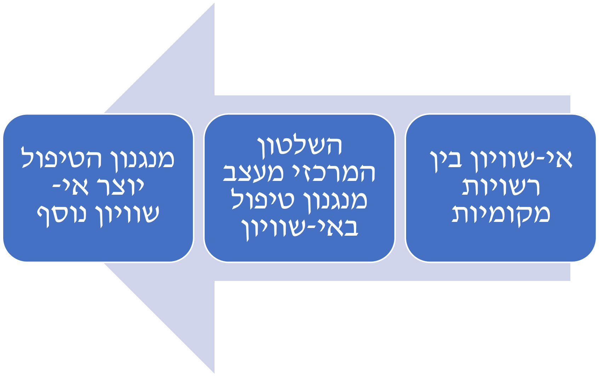
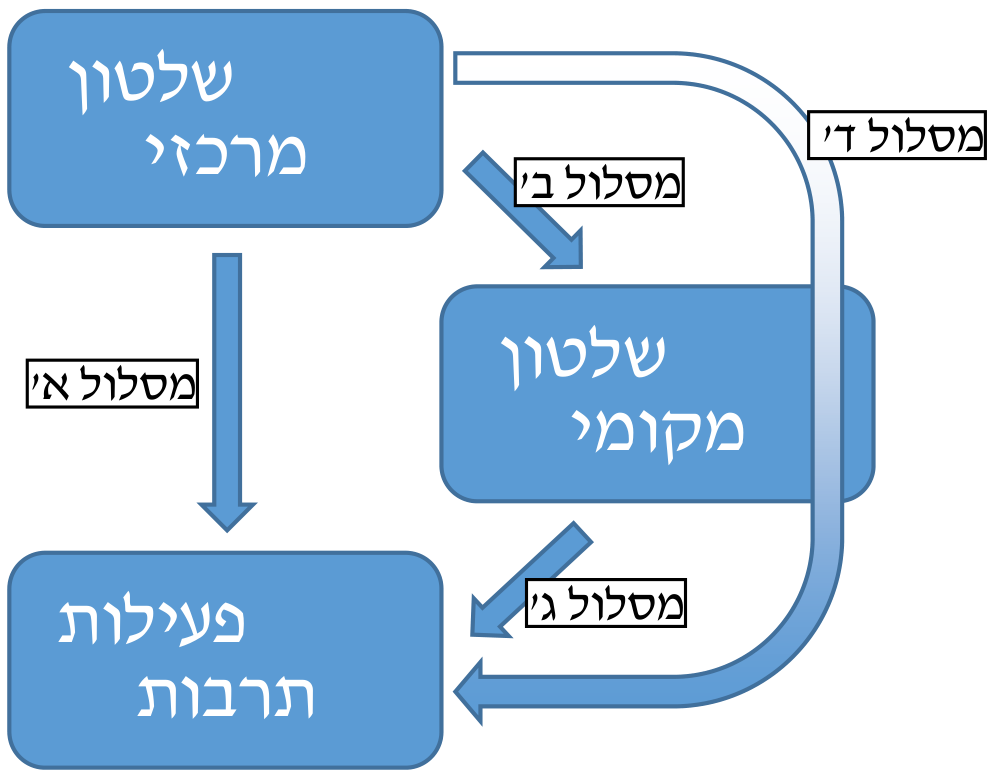
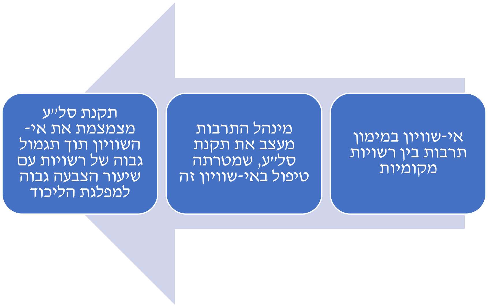

```{r}
#| label: setup
#| include: false
# The analysis itself lives in the {targets} pipeline (_targets.R, R/).
# This document only reads its results and draws the figures and tables.
library(targets)
library(tinytable)
tar_source()
```

::: {.title-page}
**"דיבידנד הנאמנות בתרבות":**

**צמצום אי-שוויון במימון תרבות ככלי לבניית נאמנות פוליטית**

מתן חכים

עבודת גמר מחקרית (תזה) המוגשת כמילוי חלק מהדרישות

לקבלת התואר "מוסמך האוניברסיטה"

אוניברסיטת חיפה

הפקולטה למדעי החברה

החוג לסוציולוגיה

יולי, 2024
:::



::: {.title-page}
**"דיבידנד הנאמנות בתרבות":**

**צמצום אי-שוויון במימון תרבות ככלי לבניית נאמנות פוליטית**

מאת: מתן חכים

בהנחיית: פרופ' טלי כץ-גרו

עבודת גמר מחקרית (תזה) המוגשת כמילוי חלק מהדרישות

לקבלת התואר "מוסמך האוניברסיטה"

אוניברסיטת חיפה

הפקולטה למדעי החברה

החוג לסוציולוגיה

יולי, 2024

מאושר על ידי \_\_\_\_\_\_\_\_\_\_\_\_\_\_\_\_\_\_\_\_\_\_\_\_\_\_\_ תאריך \_\_\_\_\_\_\_\_\_\_\_\_\_\_\_\_

(מנחה/ת העבודה)

מאושר על ידי \_\_\_\_\_\_\_\_\_\_\_\_\_\_\_\_\_\_\_\_\_\_\_\_\_\_\_ תאריך \_\_\_\_\_\_\_\_\_\_\_\_\_\_\_\_

(יו"ר הוועדה החוגית לתואר שני)
:::



ראשית, אני רוצה להודות לפרופ' טלי כץ-גרו, שנתנה את התמיכה, ההכוונה והסיוע שהיו כל-כך נדרשים לכתיבת עבודה זו. בזכותה הצלחתי לנווט בין אתגרים מתודולוגיים ותאורטיים, ולהגיע בסופו של דבר לקו הסיום בשנים המאתגרות ביותר עבור סטודנטים בישראל ועבורי בפרט. במיוחד, שמורה לה תודה על ההכנסה שלי לתוך עולם האקדמיה באופן תומך, אמפתי ופקוח-עיניים. איני מסוגל לדמיין מנחה מתאימה ואיכותית יותר עבורי.

תודה לד"ר אסף לבנון ולפרופ' איתי בארי, שהנחו אותי בשני סמינריונים בהנחייה אישית בנושאים המשיקים לליבה של עבודה זו. התובנות שעלו בעבודה איתם הפכו ליקרות ערך בכתיבת העבודה.

תודה לד"ר אסא מרון, על ההערות הבונות והמועילות הן עבור הצעת המחקר והן עבור העבודה הסופית. כמו כן, ההשתתפות שלי בפרויקטי מחקר משיקים תחתיו תרמה להתפתחותי המקצועית והמחקרית.

תודה למשתתפים בסדנה הרב-תחומית בנושא אי-שוויון, עוני, הדרה וצדק חברתי באוניברסיטת חיפה ולמשתתפים במושב תרבות בכנס האגודה הסוציולוגית הישראלית בשנת 2022. ההערות הבונות ומאירות העיניים של המשתתפים על השלבים הראשוניים של עבודתי תרמו לדיוק כיווני ההתפתחות הסופיים שלה.

תודה לפרופ' דני גוטוויין ולד"ר טל אלמליח, הדמויות האקדמיות שהשפיעו עלי יותר מכל במהלך התואר הראשון שלי, שדחפו אותי להמשיך את התפתחותי האקדמית והיוו אוזן קשבת וכתף תומכת.

תודה לגב' שלומית כהן-גולן שניצחה ביד רמה על התהליך המנהלי שלי בתוך החוג לסוציולוגיה ונתנה מעטפת אישית חמה ותומכת.

תודה לחברי בצוות המכון הישראלי למדיניות תרבות – אור, יהל וגור – שהיו שותפים לדרך וידעו לתת את כל התנאים לביצוע מחקר זה.

ואחרונה חביבה, תודה גדולה לזוגתי, שבמהלך העבודה הפכה גם לאשתי, הילה. היא ידעה מתי לשאול, מתי לתמוך, מתי לקרוא ולהעיר ומתי לדרבן. בזכותה הצלחתי להגיע לקו הסיום ואני מוקיר את השותפות המיוחדת והחזקה שלנו.



::: {.content-visible unless-format="docx"}
# תוכן העניינים {.unnumbered .unlisted}
:::

::: {.content-visible when-format="docx"}
::: {custom-style="TOC Heading"}
תוכן העניינים
:::

```{=openxml}
<w:p><w:r><w:fldChar w:fldCharType="begin" w:dirty="true"/></w:r><w:r><w:instrText xml:space="preserve"> TOC \o "1-3" \h \z \u </w:instrText></w:r><w:r><w:fldChar w:fldCharType="separate"/></w:r><w:r><w:t>לעדכון תוכן העניינים יש ללחוץ על F9 בתוך המסמך.</w:t></w:r><w:r><w:fldChar w:fldCharType="end"/></w:r></w:p>
```
:::

::: {.content-visible when-format="typst"}
```{=typst}
#outline(title: none, depth: 3, indent: 1.5em)
```
:::

::: {.content-visible when-format="html"}
::: {#toc-list}
:::
:::



::: {.title-page}
**"דיבידנד הנאמנות בתרבות":**

**צמצום אי-שוויון במימון תרבות ככלי לבניית נאמנות פוליטית**

מתן חכים
:::

# [תקציר]{.underline} {.unnumbered}

עבודה זו בוחנת את היקפו של אי-השוויון בין רשויות מקומיות בישראל במימון תרבות ושואלת כיצד ניתן להסביר את הצמצום של אי-שוויון זה בתקופת כהונתה של השרה מירי רגב. העבודה משלבת בין שלושה תחומי דעת מרכזיים: חקר השלטון המקומי בישראל, ובפרט אי-השוויון בין רשויות מקומיות; חקר מימון תרבות, ובפרט אי-השוויון במימון תרבות בישראל; וחקר הקשר בין מעמד לפוליטיקה בישראל, ובפרט תיזת "שלטון הנאמנות". הממצאים המרכזיים הם שאי-השוויון במימון תרבות בין רשויות מקומיות בישראל הצטמצם במהלך כהונתה של השרה רגב בשנים 2016-2019, וזאת לעומת השנים 2013-2015. אי-השוויון הצטמצם בכלל החתכים שנבחנו: בין רשויות יהודיות לבין רשויות ערביות, בין עיריות ומועצות אזוריות לבין מועצות מקומיות, בין רשויות חזקות לבין חלשות מבחינה חברתית-כלכלית, בין רשויות במרכז לבין רשויות בפריפריה הגאוגרפית וגם במדדי אי-שוויון כוללים. נמצא כי הסיבה המרכזית לצמצום זה באי-השוויון במימון תרבות נבע מהטמעתה של תקנת "סל לתרבות עירונית", פרויקט הדגל של השרה רגב בשנים אלו. לבסוף, מניתוח של גובה הזכאות התקציבית לתקנת סל"ע, עולה כי מתקיים אפקט של "דיבידנד נאמנות בתרבות". כלומר, ככל שאחוז ההצבעה ברשות מקומית למפלגת הליכוד בבחירות 2015 היה גבוה יותר, כך גם גובה הזכאות לתמיכה כספית מתקנת סל"ע בשנת 2018 היה גבוה יותר. כך, המסקנה המרכזית מעבודה זו היא שתקנת סל"ע מימשה את שלטון הנאמנות בתחום מימון התרבות בישראל על ידי מתן "דיבידנד נאמנות בתרבות". כלומר, היא צמצמה את אי-השוויון במימון תרבות בישראל תוך שימוש בתקציבי תקנה זו ככלי לבניית נאמנות פוליטית לימין.



# רשימת איורים וטבלאות {.unnumbered}

::: {.content-visible when-format="docx"}
```{=openxml}
<w:p><w:r><w:fldChar w:fldCharType="begin" w:dirty="true"/></w:r><w:r><w:instrText xml:space="preserve"> TOC \h \z \t "Image Caption,1" </w:instrText></w:r><w:r><w:fldChar w:fldCharType="separate"/></w:r><w:r><w:t>לעדכון רשימת האיורים יש ללחוץ על F9 בתוך המסמך.</w:t></w:r><w:r><w:fldChar w:fldCharType="end"/></w:r></w:p>
<w:p><w:r><w:fldChar w:fldCharType="begin" w:dirty="true"/></w:r><w:r><w:instrText xml:space="preserve"> TOC \h \z \t "Table Caption,1" </w:instrText></w:r><w:r><w:fldChar w:fldCharType="separate"/></w:r><w:r><w:t>לעדכון רשימת הטבלאות יש ללחוץ על F9 בתוך המסמך.</w:t></w:r><w:r><w:fldChar w:fldCharType="end"/></w:r></w:p>
```
:::

::: {.content-visible when-format="typst"}
```{=typst}
#outline(title: none, target: figure.where(kind: "quarto-float-fig"))
#outline(title: none, target: figure.where(kind: "quarto-float-tbl"))
```
:::

::: {.content-visible when-format="html"}
::: {#list-of-figures}
:::
::: {#list-of-tables}
:::
:::



# מבוא

בעוד שהמדיניות בתחומים חברתיים רבים, כגון חינוך, בריאות, רווחה, דיור ותעסוקה, עומדת במרכזו של השיח הציבורי בישראל, הנושא של מדיניות התרבות נדחק לקרן זווית. המחקר האקדמי הבוחן את מדיניות התרבות בישראל מוגבל בהיקפו, ובמקביל לכך השיח הציבורי נע בין התעלמות ממדיניות תרבות לבין שימוש בה ככלי לניגוח פוליטי. המחקר המועט שכן התבצע עד כה בישראל, בחן בעיקר את מדיניות התרבות של השלטון המרכזי באמצעות ניתוח של מימון תרבות והזניח את תפקידו של השלטון המקומי בנושא זה. במקביל לכך, לאור המשבר הפוליטי-פרלמנטרי בו נמצאת ישראל מאז 2019, ובמיוחד לאור משבר הקורונה, עולה ההכרה בחשיבותו של השלטון המקומי כגוף מחולל ומקדם מדיניות (פינקלשטיין, 2020ב). עבודה זו בוחנת את טיב היחסים שבין השלטון המרכזי והשלטון המקומי בישראל בתחום מדיניות התרבות, תוך בחינה מדוקדקת של מנגנוני התקצוב המתקיימים בין שני רובדי שלטון אלו. המטרה היא לשפוך אור על תמונת המצב ומכלול הגורמים המשפיעים על מדיניות המימון של תרבות בישראל, תוך מבט על שני ממדים מרכזיים: אי-שוויון במימון תרבות ושיקולים פוליטיים במימון תרבות.

# סקירת ספרות

## השלטון המקומי

### מבנה השלטון המקומי בישראל

השלטון המקומי בישראל מורכב מ-257 רשויות שונות, הנחלקות לארבעה סוגים: עירייה, מועצה מקומית, מועצה אזורית ומועצה מקומית תעשייתית. הרשויות המקומיות הללו נתונות תחת כפיפות כפולה: מחד, הן כפופות למשרד הפנים, המשרד האחראי בממשלה על השלטון המקומי; מאידך, הן כפופות לכל אחד ממשרדי הממשלה הרלוונטיים האחרים, כל אחד בתחומו – חינוך, רווחה, הגנת הסביבה וכו' (בארי, 2014). לא קיים גוף אחיד ויציג עבור הרשויות המקומיות, המהווה בית או כתובת לשלטון המקומי בישראל, בשונה מהממשלה שמהווה את המוקד של השלטון המרכזי. לכן, מקובל לנתח את המבנה של השלטון מקומי בישראל כאוסף של 257 רשויות מקומיות בעלות מאפיינים שונים, אשר כל אחת מהן מנוהלת באופן שונה, ולא כשלטון מקומי אחיד בעל מאפיינים משותפים (שם). במילים אחרות, ניתן לטעון כי בין רשויות מקומיות שונות מתקיימת שונות גבוהה באשר ליחסיהן השונים עם השלטון המרכזי בישראל.

![מבנה השלטון המקומי בישראל[^1]](figures/static/fig01_local_government_structure.png){#fig-local-government fig-alt="תרשים היררכי של מבנה השלטון המקומי בישראל. למעלה הרשות המבצעת, ומתחתיה משרדי הממשלה ומשרד הפנים עם ששת מחוזותיו; מהם יורדים קווים אל 257 הרשויות המקומיות, המתחלקות ל-75 עיריות, 126 מועצות מקומיות, 2 מועצות מקומיות תעשייתיות ו-54 מועצות אזוריות, ותחת המועצות האזוריות 980 ועדים מקומיים. סוגריים מסולסלים בצד מסמנים את החלק העליון כשלטון מרכזי ואת החלק התחתון כשלטון מקומי."}

מבחינה היסטורית, מבנה זה של השלטון המקומי, המתואר באיור -@fig-local-government, התהווה לאור מתח מובנה בין תפקידיו השונים. תפקיד אחד הוא להוות גוף ממשלי ברמה המקומית המממש את זכותן של קהילות שונות לאוטונומיה ולדמוקרטיה, אך תפקיד אחר הוא להוות זרוע ביצוע ארוכה של המדינה (לוי, 2014). לדוגמה, בחוק חינוך ממלכתי ובחוק שירותי הסעד מוגדרות החובות המושתתות על רשויות מקומיות לספק שירותים חברתיים אחידים לפי ההגדרות והמדיניות של השלטון המרכזי (שם). מגמה זו התחילה עוד בימי המנדט הבריטי, שהחזיק בשתי מטרות סותרות: מצד אחד, לממש את המנדט שניתן לו על-ידי האומות המאוחדות ולפתח מוסדות ממשל יהודיים ופלסטיניים, ומצד שני לשלוט על הקהילות המקומיות במסגרת האימפריאליזם הבריטי והאינטרסים הייחודיים לו (שם). עם השנים העמיקה בישראל תפיסה של רשויות מקומיות כסוכנות של השלטון המרכזי, ולא כשותפות לו. כלומר, תפקידן של הרשויות המקומיות להוות סוכנות לביצוע ולמימוש המדיניות של רשויות המדינה. זאת, בניגוד לתפקידן האפשרי כשותף שווה לממשל, המייצג את התושבים ומאזן את כוחה של המדינה (שם).

### יחסי שלטון מרכזי-מקומי בישראל

כאמור, השלטון המקומי בישראל התהווה כזרוע ביצוע של השלטון המרכזי. כך, בבואנו לתאר את היחסים המתקיימים בישראל בין השלטון המרכזי לשלטון המקומי, ניתן לטעון כי מערכת השלטון בישראל היא ריכוזית ביותר, כלומר מבכרת את כוחו של השלטון המרכזי על פני השלטון המקומי. על כך מסכימים בארי ורזין (2015), לוי (2014) ופינקלשטיין (2020א). עדות לריכוזיות זו ניתן למצוא במחקר שדירג את ישראל במקום ה-98 בעולם מתוך 182 מדינות במדד הביזור, כלומר במידה שבה השלטון המקומי מהווה נדבך משמעותי ממבנה הממשל, כאשר המדינה המדורגת במקום מספר 1 היא המדינה המבוזרת ביותר (Ivanyna & Shah, 2014). המצב האפשרי ההפוך למערכת ריכוזית הוא מערכת מבוזרת, כלומר כזו המעדיפה דווקא את השלטון המקומי, מעבירה אליו סמכויות ומשאבים ומציבה אותו כגורם שלטוני מהותי נוסף ולא כגורם ביצועי גרידא.

את עיקר מנגנוני השליטה, הפיקוח והבקרה של השלטון המרכזי כלפי השלטון המקומי מפעילים משרדי הפנים והאוצר (לוי, 2014). בין הדוגמאות למנגנונים אלו ניתן למנות: פיקוח על קביעת שיעורי ארנונה; חיוב באופן אישי של בעלי תפקידים ברשות על הוצאות שלא התבצעו כדין; מינוי גובה מלווה או חשב מלווה לרשות, המחזיק בסמכויות בתחומי הגבייה וההוצאה של כספים ברשות; פיטורים של ראש הרשות ומועצת הרשות ומינוי של פקידים שינהלו את הרשות במקומם (שם). מנגנונים אלו מאפשרים במקרים רבים למשרדי הפנים והאוצר להתערב באופן פעיל בהתנהלותן של רשויות מקומיות. יתר על כן, מכיוון שהרשויות המקומיות מודעות לקיומם של מנגנונים אלו, הן מראש יפעלו כדי להימנע מהפעלתם ובכך יתאימו את עצמן לסד הציפיות המנהליות והתקציביות של השלטון המרכזי.

מלבד מנגנוני הפיקוח העיקריים של משרדי הפנים והאוצר העוסקים בנושאים מנהליים ותקציביים כלליים, מופעלים גם מנגנוני בקרה ופיקוח על רשויות מקומיות בתחומיהם של משרדי הממשלה המקצועיים השונים. לדוגמה, רשויות מקומיות כפופות למשרד החינוך בכל הנוגע למספר הילדים בכיתות, לתנאי ההעסקה של נשות ואנשי צוות ההוראה ולתכניהן ומבניהן של תוכניות הלימוד. כמו כן, הן כפופות למשרד הרווחה בכל הנוגע לתנאי הזכאות לטיפול בתושבים הנזקקים (שם). כך, למרות שהרשויות עצמן מעורבות ביותר במה שנעשה בתחומים אלו ולמעשה הן אלו המפעילות אותם, הן בפועל נמצאות תחת שליטה הדוקה וריכוזית של משרדי הממשלה הרלוונטיים.

### אופני ניהול ומתן שירותים ברשויות מקומיות

לאחר שבחנו את מבנה השלטון המקומי בישראל ואת היחסים בין השלטון המרכזי לשלטון המקומי, ראוי להפנות את המבט פנימה – לתוך הרשות המקומית עצמה. אם עד כה נבחנו המשאבים שהגיעו לרשות המקומית ממשרדי הממשלה והשונות הרבה בין הרשויות, כעת יבחן האופן שבו הרשות המקומית עושה שימוש במשאבים אלו. בארי (2014) מתאר תהליך עולמי ורחב-היקף במסגרתו בעשורים האחרונים אופן ההפעלה והניהול של השלטון המקומי משתנה, והופך "משלטון מקומי למשילות מקומית" ("From Local Government to Local Governance") (שם, עמ' 272).[^2] מושג המשילות המקומית משמש כדי להסביר את האופנים החדשים בהם הרשות המקומית באה במגע עם סביבתה, פועלת כלפיה, ולמעשה מדובר בשינוי של עצם מהותה וחשיבותה של הרשות המקומית. בפרט, הוא מציין שינויים בשלושת התחומים הבאים: מתן שירותים, שיתוף תושבים ואופן הניהול.

ראשית, בארי טוען כי רשויות מקומיות עוברות מדפוס של ייצור שירותים (Production) לדפוס של אספקת שירותים (Provision). כלומר, הרשות המקומית אינה האחראית הבלעדית על שירות מסוים, אלא בכוחה לבוא בהסכם עם חברה עסקית או עמותה פרטית כך שאלו יהיו הספקיות של השירות המדובר. בכך, הרשות מוותרת על תפקידה כיצרנית ותופסת תפקיד של מאסדרת (רגולטורית) או של מפקחת. שנית, המעבר למשילות מקומית טומן בחובו שיתוף גובר והולך של תושבים בקבלת החלטות. שיתוף שכזה עשוי לכלול פרסום של מידע, היוועצות עם תושבים במסגרת "שולחנות עגולים" ואף מתן תפקידים רשמיים לנציגי תושבים במסגרת פעילות הרשות. לבסוף, בארי מתאר מעבר מניהול אנכי של רשות, כלומר מניהול היררכי של בעלי תפקידים שונים בתוך הרשות המקומית כארגון, לניהול רוחבי או רשתי. במסגרת שיטת ניהול חדשה זו, הרשות פועלת כמתכללת של תחומים שונים אשר בכל אחד מהם פעיל אוסף של ארגונים, גופים, חברות, עסקים, עמותות, קהילות וקבוצות מסוגים שונים. במובן זה, אסטרטגיית ההתמודדות של רשות עם בעיות אינה למצוא מענה מיידי מקרב בעלי התפקידים בשכר ברשות עצמה, אלא לתכלל מענה שלם המקיף את כלל בעלי העניין הרלוונטיים במרחב.

### ממדי אי-השוויון בין רשויות מקומיות בישראל

עקב חוסר הקשר המוסדי בין הרשויות המקומיות השונות והיעדרו של גוף גג לשלטון המקומי בישראל, כמו גם עקב שלל סיבות היסטוריות, חברתיות וכלכליות, קיים אי-שוויון רב בין רשויות מקומיות בישראל. פרק זה יציג שלושה **תחומים** במסגרתם מתקיים אי-שוויון, וזאת תוך תיאור **הממדים** השונים (כלומר, המשתנים, או מאפיינים) שלאורם ובעקבותיהם מתקיים אי-השוויון. התחומים הם אי-שוויון בשטח קרקעות, אי-שוויון בהכנסות ואי-שוויון בהוצאות. כל אחד מתחומים אלו חושף ממדים בהם מתקיים אי-שוויון בין הרשויות. כמו כן, אציג שלושה ניסיונות של השלטון המרכזי להתמודד עם אי-השוויון בין הרשויות המקומיות, ואראה מחקרים המציגים כיצד גם התוצאות של ניסיונות אלו יוצרות אי-שוויון ומיטיבות עם קבוצות ספציפיות, לרוב כאלו הקרובות יותר לשלטון. לתיאור זה ישנה חשיבות מכיוון שעבודה זו תבחן גם היא ממדים ויחסים של אי-שוויון בין רשויות מקומיות בתחום מימון תרבות, תוך ניסיונות של השלטון המרכזי לצמצם אי-שוויון זה.

התחום הראשון והבסיסי ביותר במסגרתו מתקיים אי-שוויון בין רשויות מקומיות הוא **חלוקת הקרקע**. בשנים הראשונות לקום המדינה עוצבה מפת החלוקה לרשויות מקומיות לאור שני אירועים מרכזיים: הסכסוך הישראלי-פלסטיני (או יהודי-ערבי) ומדיניות יישוב העולים החדשים לישראל (בארי, אהרון-גוטמן ולוזר, 2020). ראשית, רשויות מקומיות ערביות סבלו מהפקעת שטחים פרטיים, מהיותן תחת ממשל צבאי עד שנת 1966 ומתחימתן בשטחים מוגבלים על-ידי רשויות מקומיות יהודיות. כך, משאבי הקרקע הזמינים לרשויות מקומיות ערביות היו מוגבלים ביותר. שנית, עולים חדשים יושבו בעיקר בעיירות הפיתוח בפריפריה, ובכך אוכלוסיות מהגרים מרקע חברתי-כלכלי חלש יותר הגדילו את אי-השוויון בין רשויות מקומיות. ממדים נוספים של אי-שוויון בשנותיה הראשונות של ישראל קשורים בהעדפה של מועצות אזוריות שהכילו קיבוצים על פני מועצות אזוריות שהכילו מושבי עולים; העדפה של רשויות מקומיות במרכז הארץ על פני אלו בפריפריה; והעדפה של עיריות ומועצות אזוריות שיושבו בתושבים ותיקים או עולים מאירופה ממעמד חברתי-כלכלי גבוה, וזאת על פני עיירות פיתוח בהן התגוררו אוכלוסיות מוחלשות: בני מיעוטים, עולים חדשים ובני מעמד חברתי-כלכלי נמוך (שם). כלומר, ניתן לזהות כאן **ממדים לאומיים, גאוגרפיים, חברתיים-כלכליים ואתניים** של אי-שוויון בין רשויות מקומיות. תחום נוסף בו מתקיים אי-שוויון בין רשויות מקומיות הוא **הכנסותיהן הכספיות**, בעיקר כתוצאה מגביית מיסים. בעקבות המעבר ממימון ממשלתי של השלטון המקומי למימון עצמי בשנות ה-80 וה-90, התלות של רשויות במעמד החברתי-כלכלי של תושביהן, כדי לגבות את מס הארנונה, גדלה. כך, רשויות מקומיות חזקות מבחינה חברתית-כלכלית נהנו משינוי זה ואילו רשויות חלשות יותר נפגעו והפכו לתלויות יותר בחסדי השלטון המרכזי (לוי, 2014).

מכיוון שמתקיים אי-שוויון בהכנסות בין רשויות מקומיות, ומאחר שאי-שוויון זה אינו מטופל היטב על-ידי השלטון המרכזי, ברור כי יתקיים אי-שוויון בין הרשויות גם **בצד ההוצאות**. אחד התחומים הנחקרים ביותר בהקשר זה הוא בהוצאותיהן של רשויות מקומיות בתחום החינוך. מספר מחקרים בישראל (בן בסט ודהן, 2009; בלס, זוסמן וצור, 2016) מצביעים על כך שרשויות מקומיות מרקע חברתי-כלכלי גבוה יותר מוציאות יותר כסף על חינוך לתלמיד מאשר רשויות מקומיות מרקע חברתי-כלכלי נמוך יותר. כלומר, בעוד שהמשאבים הניתנים על-ידי השלטון המרכזי מחולקים כביכול באופן שוויוני, ולעיתים אף באופן של העדפה מתקנת המיטיבה עם רשויות חלשות יותר, הרי שהמצב הסופי הוא של אי-שוויון בהוצאות על חינוך. בכך ניתן לזהות ביסוס של **הממד החברתי-כלכלי** באי-שוויון בין רשויות מקומיות.

לאחר ההצגה של שלוש דוגמאות לתחומים בהם מתקיים אי-שוויון בין רשויות מקומיות, נבחן שלוש דוגמאות לניסיונות של השלטון המרכזי להתמודד עם מצבי אי-שוויון אלו. ראשית, תחום אי-השוויון בקרקעות היה מושא לביקורת במשך שנים רבות, והתבצעו מספר צעדים שונים כדי להתמודד איתו, ביניהם הקמה של ועדות גבולות אד-הוק והקמתן של הוועדות הגאוגרפיות הקבועות בשנת 2016. מחקרם של בארי, אהרון-גוטמן ולוזר (2020) בחן את תוצאותיהן של ועדות הגבולות. כלומר, מדובר במחקר שבחן את האופן שבו השלטון המרכזי הגיב לאי-שוויון במשאבים בשלטון המקומי ועסק בחלוקה מחדש של משאבים – במקרה הזה, משאבי קרקע. ממצאיהם מצביעים על כך שהרשויות החלשות מבחינה חברתית-כלכלית שזכו בתוספות גדולות לשטחיהן מאופיינות בלפחות אחד מהמאפיינים הבאים: ממוקמות במרכז הארץ, שייכות לרוב היהודי, או מקורבות פוליטית לשר הפנים ולמחנה הימני-חרדי. כלומר, רשויות בפריפריה הגאוגרפית, רשויות ערביות ורשויות שאינן מקושרות היטב מבחינה פוליטית נהנו במידה פחותה מהגדלת שטחיהן (שם). ממצאים אלו חשובים לעניין עבודה זו מכיוון שהם מדגישים נקודה מרכזית – **גם כאשר קיים אי-שוויון וכאשר השלטון המרכזי מחליט להפעיל אמצעי מדיניות כדי להתמודד עם אי-השוויון, הרי שאמצעים אלו אינם פועלים במידה שווה על כלל הקבוצות והרשויות** ונתונים להשפעה של מאפיינים חברתיים שונים. בפרט, במחקר זה נחשפת חשיבותו של **ממד השיוך הפוליטי** כגורם המחולל אי-שוויון בין רשויות מקומיות, כאשר רשויות מקומיות המזוהות עם מפלגות השלטון נהנות ממשאבים רבים יותר.

לאופיו של אי-השוויון בקרקע ולמנגנון הטיפול באי-שוויון זה ישנה חשיבות תאורטית ומתודולוגית עבור עבודה זו. ראשית, ישנו דמיון בין אי-שוויון בקרקעות לבין אי-שוויון בתרבות באופן השימוש הפוליטי באי-השוויון. בשני המקרים המחאה ייצגה בעיקר ציבור יהודי מעיירות פיתוח ושמצביע בעיקרו לימין, והופנתה בעיקר כנגד הציבור היהודי מהמועצות האזוריות והערים שמצביע בעיקרו לשמאל.[^3] שנית, בשני המקרים השלטון המרכזי הכיר באופן רשמי ומוסדי באי-השוויון ויצר מנגנון ברור לטיפול בו. שלישית, בשני המקרים השלטון המקומי היה שחקן מרכזי בתוך מנגנון הטיפול באי-השוויון, דרך ועדות הגבולות בתחום הקרקעות ותקנת סל"ע (ראו בהמשך) בתחום התרבות. רביעית, בשני המקרים השיוך הפוליטי למחנה הימין מהווה גורם תורם לקבלת משאבים רבים יותר כתוצאה ממנגנון הטיפול באי-השוויון. לבסוף, עבודה זו עושה שימוש במודל סטטיסטי דומה לזה שדווח במחקרם של בארי ואחרים (2020), כלומר רגרסיה מרובת משתנים תוך שימוש במשתנה מיתון (כלומר, אינטראקציה). מכל הסיבות הללו בחרתי לכלול את הפירוט בדבר אי-השוויון בקרקעות, על אף שלא מדובר באי-שוויון במימון, כפי שקיים בתחומי ההכנסות וההוצאות.

שנית, כדי להתמודד עם תחום אי-השוויון בהכנסות כספיות, הוכנסו בשנות ה-90 "מענקי האיזון" שנועדו לפצות על פער מבני בקרב רשויות חלשות בין הוצאותיהן הגבוהות, עקב שירותי רווחה וסעד נרחבים יותר, לבין הכנסותיהן הנמוכות, הקשורות בחוסר יכולת של רבים מתושביהן לשלם את מס הארנונה. כלומר, זהו מקרה נוסף בו המדינה זיהתה מצב של אי-שוויון בין רשויות מקומיות הנגרם כתוצאה מפעולותיה, והפעילה אמצעי מדיניות כדי להתמודד עם כך. יחד עם זאת, גם במקרה זה רשויות מקומיות יהודיות נהנו מהמענקים יותר מאשר רשויות מקומיות ערביות, ורשויות מקומית בשטחים ובצפון הארץ נהנו מהמענקים יותר מאשר רשויות בדרום (בן דוד וארז, 2007). בכך ניתן לזהות ביסוס של **הממד הלאומי והממד הגאוגרפי** באי-שוויון בין רשויות מקומיות.

שלישית, כדי להתמודד עם אי-השוויון בהוצאות בין רשויות מקומיות, משרדי הממשלה עושים פעמים רבות שימוש בתקצוב פרוגרסיבי. כלומר, ככל שלרשות מקומית ישנו מדד חברתי-כלכלי נמוך יותר, כך התקצוב הממשלתי יהיה גבוה יותר. יחד עם זאת, מערכת זו מביאה איתה לעיתים ממדים נוספים של אי-שוויון. לדוגמה, הוצג לעיל כי בין רשויות מקומיות מתקיים אי-שוויון בהוצאות על תחום החינוך. כדי לתת לכך מענה, משרד החינוך מפעיל מערכת תקצוב דיפרנציאלית, כך שתלמיד מרקע חברתי-כלכלי חלש יקבל תקציב גבוה יותר מאשר תלמיד מרקע חברתי-כלכלי חזק. חרף מאמצים אלו, דוח מבקר המדינה מראה כי בתוך כל חמישון טיפוח[^4] ישנם פערי מימון בין תלמידים יהודים וערבים, כך שתלמידים ערבים מקבלים פחות תקציב. יתר על כן, ככל שהתלמידים מגיעים מרקע חברתי-כלכלי חלש יותר, כך הפער הבין-מגזרי במימון גבוה יותר (מבקר המדינה, 2023). כלומר, הניסיון של משרד החינוך לטפל באי-שוויון חברתי-כלכלי לוקה בעצמו באי-שוויון על רקע **לאומי**.

כך, סקרנו שלושה מנגנוני טיפול של השלטון המרכזי באי-שוויון בין רשויות מקומיות, וראינו כי פעמים רבות מנגנון טיפול זה מביא עימו תוצאות המתאפיינות גם הן באי-שוויון נוסף (ראו טבלה -@tbl-inequality-examples). מכך עולה דפוס קבוע ביחס לאופן טיפול השלטון המרכזי באי-שוויון בין רשויות מקומיות: קיום של אי-שוויון בתחום כלשהו, עיצוב מנגנון טיפול באי-שוויון זה, ולבסוף תוצאות מנגנון הטיפול יוצרות אי-שוויון נוסף, מסדר שני (ראו איור -@fig-central-pattern). בעבודה זו אבחן מנגנון דומה של ניסיון מצידו של השלטון המרכזי לפצות על אי-שוויון בין רשויות מקומיות בתחום מימון תרבות, ואת תוצאות המדיניות הנלוות לכך. לאחר שתואר לעומק מצבו של השלטון המקומי בישראל, נעבור לבחון את המחקר בנושא מימון התרבות בישראל. כך, נוכל להשלים את התמונה המצטיירת בבואנו לבחון את סוגיית מימון התרבות ברשויות מקומיות בישראל.

+----------------+-----------------------------------+-------------------------+------------------------------------------+
| תחום אי-שוויון | ממדי אי-שוויון                    | מנגנון טיפול באי-שוויון | תוצאות מנגנון טיפול                      |
+================+===================================+=========================+==========================================+
| קרקעות         | לאומי, גאוגרפי, חברתי-כלכלי ואתני | ועדות גבולות            | חיזוק רשויות יהודיות, ימניות, במרכז הארץ |
+----------------+-----------------------------------+-------------------------+------------------------------------------+
| הכנסות         | חברתי-כלכלי                       | מענקי איזון             | חיזוק רשויות יהודיות, בשטחים ובצפון      |
+----------------+-----------------------------------+-------------------------+------------------------------------------+
| הוצאות         | חברתי-כלכלי                       | תקצוב דיפרנציאלי        | חיזוק תלמידים יהודים                     |
+----------------+-----------------------------------+-------------------------+------------------------------------------+

: דוגמאות לאי-שוויון בין רשויות מקומיות {#tbl-inequality-examples}

{#fig-central-pattern fig-alt="חץ רחב הפונה שמאלה ובו שלוש תיבות ברצף: אי-שוויון בין רשויות מקומיות; השלטון המרכזי מעצב מנגנון טיפול באי-שוויון; מנגנון הטיפול יוצר אי-שוויון נוסף."}

## מימון תרבות

### מימון תרבות בעולם

מימון תרבות הוא תת-תחום בתוך התחום המחקרי הרחב יותר העוסק במדיניות תרבות. אם ניתן להגדיר "מדיניות תרבות" בתור "מכלול פעולות הממשלה ביחס לאמנות, מדעי הרוח והמורשת" (Schuster, 2003; התרגום לעברית מתוך פדר, 2019), הרי שמובן כי מדובר בתחום המכיל סוגי פעולות רבים ומגוונים, ביניהם ניתן למנות מימון, מענקים, רגולציה, חקיקה, תשתיות ומתקנים, העסקה ופרקטיקות נוספות, כאשר מימון הוא כלי המדיניות המרכזי והמשמעותי ביותר (פדר, 2019). המחקר הקיים העוסק במימון תרבות הולך וצובר תאוצה בשנים האחרונות. אצל Feder & Katz-Gerro (2012) ניתן למצוא סקירה מקיפה של מחקרים שפורסמו עד 2012 על אודות המשתנים הקשורים במימון ציבורי של תרבות. רוב המחקרים בוחנים משתנים כלכליים, דמוגרפיים, פוליטיים ומרחביים ובוחנים מהי מידת המובהקות של הקשר הסטטיסטי שלהם עם גובה ההוצאה על תרבות. בשנים לאחר מכן, ניתן למצוא מסה נוספת של מחקר בתחום בגיליון של כתב העת *Poetics* משנת 2015 שהוקדש לנושא המימון הציבורי של תרבות. באמצעות בחינה של תמיכות של השלטון המרכזי או המקומי בתרבות בארה"ב (Rushton, 2015; Noonan, 2015), איטליה (Dalle Nogare & Bertacchini, 2015), שווייץ (Rössel & Weingartner, 2015), אוסטריה (Getzner, 2015) וישראל (Feder & Katz-Gerro, 2015), גיליון זה שופך אור נוסף על המשתנים השונים המקושרים לתמיכה בתרבות.

התובנות המרכזיות העולות ממחקרים אלו מרתקות במידה שהן מגוונות. לדוגמה, Getzner מראה קשר חיובי חזק ומובהק בין מימון תרבות לבין תוצר מקומי גולמי (Getzner, 2015), וברמה המקומית הוצאה גבוהה יותר על תרבות ברשויות מקומיות גדולות יותר (Getzner, 2022). בנוסף אליו, Noonan מראה כי להכנסות של מדינה (state) קשר ישיר ליכולתה להוציא כסף על תרבות, וגם כי ישנה השפעה מסוימת למשתנים דמוגרפיים על ההוצאה על תרבות (Noonan, 2007). מבחינה גאוגרפית, Lundberg מראה כי אם רשות מקומית העלתה את ההוצאה שלה על תרבות, לרשויות השכנות לה תהיה נטייה להקטין את ההוצאה שלהן על תרבות (Lundberg, 2006). מלבד משתנים כלכליים, דמוגרפיים וגאוגרפיים אלו, קיימים גם משתנים פוליטיים. סקירה מקיפה על השפעתם של משתנים פוליטיים שונים על מימון תרבות ניתן למצוא אצל Dalle Nogare & Galizzi (2011), כאשר הממצאים הכוללים מראים כי לרוב למשתנים פוליטיים השפעה מוגבלת על מימון תרבות, אך כן כזו שניתנת להבחנה, לדוגמה על-ידי השפעה של שנת קיום בחירות ברשות מקומית על הוצאה נמוכה יותר על תרבות (Dalle Nogare & Galizzi, 2011). מנגד, Benito et al. מראים כי בשנת בחירות ברשות מקומית ההוצאה על תרבות דווקא עשויה לעלות כדי להפעיל מניפולציה על ציבור הבוחרים (2013). עוד ביחס לסוגיית השלטון המקומי, מחקר של Håkonsen & Løyland (2016) בוחן את ההוצאה על תרבות של רשויות מקומיות בנורווגיה לפי תחום הוצאה, ומראה חשיבות של גורמים כלכליים ודמוגרפיים ברמת הרשות עבור גובה ההוצאה של כל תחום. כמו כן, Kopańska (2022) מראה כי לרמת האוטונומיה התקציבית של רשות מקומית יש קשר לגובה ההוצאה שלה על תרבות. כלומר, המחקרים הקיימים מראים קשר בין משתנים כלכליים, דמוגרפיים, גאוגרפיים ופוליטיים על מימון תרבות. התייחסות נוספת למשתנים אתניים תובא בפרק 2.3.

נראה כי עד כה תפקידו המסוים של השלטון המקומי כשחקן הפועל בין רמת המדינה מחד ובין רמת השטח, או פעילות התרבות עצמה, מאידך, נותר מעורפל. המחקרים בתחום המצטטים ומתייחסים זה לזה נוטים לא להבחין בין רמות שונות של מימון תרבות והאם המימון מגיע מהשלטון המקומי או מהמרכזי, ולא לעסוק בטיב מערכת היחסים שבין השניים. עד כה, לא נמצאה סקירה אקדמית הבוחנת את המחקר המצטבר בתחום דרך נקודת המבט של רמת השלטון המעורבת, אלא בעיקר דרך נקודת המבט של המשתנים השונים המעורבים.

### סיווג המסלולים למימון תרבות

כדי להבהיר את אופני המימון השונים, את משמעויותיהם השונות ואת המחקר הקיים בתחום, יצרתי ארבע קטגוריות חדשות למימון תרבות. באמצעותן ניתן יהיה לסווג את המחקרים הקיימים ולבחון היכן ראוי להשקיע מחשבה ומחקר נוספים. אגדיר להלן ארבעה מסלולים למימון תרבות :

1. מסלול א', "מרכזִי-שטח" – בו הממשלה המרכזית מעבירה תקציב באופן ישיר לפעילות או למוסד תרבות, לדוגמה תמיכה תקציבית של משרד התרבות במוזיאון;

2. מסלול ב', "מרכזִי-מקומי" – בו הממשלה המרכזית מעבירה תקציב לרמה כלשהי במסגרת השלטון המקומי (מדינה [state], ממשלה מקומית, פרובינציה, מחוז, עיר וכו');

3. מסלול ג', "מקומי-שטח" – בו רמה כלשהי של השלטון המקומי מעבירה תקציב לפעילות או למוסד תרבות, לדוגמה תמיכה תקציבית של עירייה בגלריה;

4. מסלול ד', "מרכזִי-מקומי-שטח" – בו הממשלה המרכזית מעבירה תקציב ייעודי לרמה כלשהי במסגרת השלטון המקומי, ואותו שלטון מקומי עושה בו שימוש לפי שיקול דעתו. לדוגמה, תוכנית "סל תרבות עירוני" בה מועבר תקציב ייעודי מטעם משרד התרבות לרשות מקומית, והרשות משתמשת בו לפי שיקול דעתה ובהתאם לכללים שהתווה המשרד.

מכיוון שמדובר באופן סיווג חדש למחקרים מסוג זה, ראוי להקדיש לו מעט תשומת לב. לשם כך, ניתן להיעזר באיור ובטבלה שלהלן. איור -@fig-funding-routes ממחיש באופן חזותי את אופייה של מערכת היחסים המורכבת בין השלטון המרכזי, המקומי ופעילות התרבות, כמו גם את ההבדלים בין ארבעת המסלולים השונים למחקר של מימון תרבות. בנוסף לאיור, טבלה -@tbl-literature מכילה את כלל המחקרים שנמצאים בסקירת ספרות זו ועוסקים בניתוח הקשר של משתנים חברתיים שונים עם גובה ההוצאה על תרבות. טבלה זו ממיינת כל מחקר, המצוין על-פי שם המחברים ושנת הפרסום, לפי המדינה בה התבצע המחקר ומסלול המימון אותו בחן המחקר.

{#fig-funding-routes fig-alt="תרשים זרימה עם שלוש תיבות: שלטון מרכזי למעלה, שלטון מקומי מימין למטה ופעילות תרבות משמאל למטה. ארבעה חצים מסומנים באותיות: מסלול א' מהשלטון המרכזי ישירות לפעילות התרבות, מסלול ב' מהשלטון המרכזי לשלטון המקומי, מסלול ג' מהשלטון המקומי לפעילות התרבות, ומסלול ד' מהשלטון המרכזי דרך השלטון המקומי אל פעילות התרבות."}

+--------------+--------------------------+--------------------------+------------------------------+------------------------------+
| מדינה        | מסלול א' – "מרכזי-שטח"   | מסלול ב' – "מרכזי-מקומי" | מסלול ג' – "מקומי-שטח"       | מסלול ד' – "מרכזי-מקומי-שטח" |
+==============+==========================+==========================+==============================+==============================+
| **ארה"ב**    |                          |                          | Noonan, 2007                 |                              |
|              |                          |                          |                              |                              |
|              |                          |                          | Noonan, 2015                 |                              |
|              |                          |                          |                              |                              |
|              |                          |                          | Lewis & Rushton, 2007        |                              |
+--------------+--------------------------+--------------------------+------------------------------+------------------------------+
| **איטליה**   |                          |                          | Dalle Nogare & Galizzi, 2011 |                              |
+--------------+--------------------------+--------------------------+------------------------------+------------------------------+
| **שווייץ**   |                          |                          | Rossel & Weingartner, 2015   |                              |
+--------------+--------------------------+--------------------------+------------------------------+------------------------------+
| **אוסטריה**  | Getzner, 2015            |                          | Getzner, 2022                | Getzner, 2015                |
|              |                          |                          |                              |                              |
|              | Getzner, 2002            |                          |                              |                              |
+--------------+--------------------------+--------------------------+------------------------------+------------------------------+
| **ישראל**    | Feder & Katz-Gerro, 2012 |                          |                              |                              |
|              |                          |                          |                              |                              |
|              | Feder & Katz-Gerro, 2015 |                          |                              |                              |
+--------------+--------------------------+--------------------------+------------------------------+------------------------------+
| **אוסטרליה** |                          |                          | Withers, 1979                |                              |
+--------------+--------------------------+--------------------------+------------------------------+------------------------------+
| **גרמניה**   | Schulze & Rose, 1998     |                          | Schulze & Rose, 1998         |                              |
+--------------+--------------------------+--------------------------+------------------------------+------------------------------+
| **שבדיה**    |                          |                          | Lundberg, 2006               |                              |
+--------------+--------------------------+--------------------------+------------------------------+------------------------------+
| **בלגיה**    |                          |                          | Werck et al., 2007           |                              |
+--------------+--------------------------+--------------------------+------------------------------+------------------------------+
| **נורווגיה** |                          |                          | Håkonsen & Løyland, 2016     |                              |
+--------------+--------------------------+--------------------------+------------------------------+------------------------------+
| **פולין**    |                          |                          | Kopańska, 2022               |                              |
+--------------+--------------------------+--------------------------+------------------------------+------------------------------+
| **ספרד**     |                          |                          | Benito et al., 2013          |                              |
+--------------+--------------------------+--------------------------+------------------------------+------------------------------+

: מחקרים בתחום מימון תרבות, לפי מדינה ומסלול מימון נחקרת {#tbl-literature}

כפי שעולה מהטבלה, ניתן לראות שרוב המחקר התבצע עבור מסלולים א' וג'. כלומר, הוא בחן מימון ישיר של השלטון המקומי או המרכזי לפעילות תרבות. לא נראה שהתבצע כלל מחקר עבור מסלול ב', כלומר בחינה של מימון תרבות מהשלטון המרכזי לשלטון המקומי. כמו כן, המחקר שכן מופיע ככזה הבוחן את מסלול ד', כלומר מימון של שלטון מרכזי לפעילות תרבות שעובר דרך השלטון המקומי, עושה זאת באופן חלקי ומצומצם ביותר. Getzner (2015) בוחן במחקרו את המשתנים המקושרים להוצאה של השלטון המרכזי על תרבות, ואחד מממצאיו מראה כי המימון של השלטון המרכזי לתרבות פועל כגורם שמאזן את תנודות המימון של השלטון המקומי. כלומר, מדובר במסקנה מעניינת, אך היחסים בין השלטון המרכזי למקומי במחקר זה אינם עומדים בבסיסו של מערך ושאלת המחקר. לסיכום, ניתן להסיק כי המחקר עד כה בוחן בעיקר מימון של תרבות, בין אם על-ידי השלטון המקומי או המרכזי, אך ללא תשומת לב רבה לטיבה של מערכת היחסים בין רמות שונות אלו.

### מימון תרבות בישראל

לא ניתן לדבר על מחקר של מדיניות תרבות בישראל בלי להזכיר את קו פרשת המים האקדמי שלו: מסמך הקרוי 'דו"ח ברכה' שנכתב על-ידי אליהוא כ"ץ והד סלע (1999). מחקר מקיף זה מציג את אופן התמיכה באומנויות בישראל, סקרים על היצע וצריכה של תרבות בישראל, סוגיות של רב-תרבותיות ומוקדים שונים של בעיות בשדה התרבות בישראל. מטרתו המוצהרת של המחקר היא "לספק סקירה כללית של מוסדות התרבות והפנאי ופעולתם, להאיר בעיות שיש לתת עליהן את הדעת ולנסח חלופות שיש לבחור ביניהן" (שם, עמ' 10). למרות שחלפו 25 שנים מאז פרסום הדוח, אף מחקר ישראלי דומה מבחינת רוחב היריעה או עומק הניתוח לא ראה אור.

המחקר האקדמי העכשווי על מימון תרבות בישראל דל ביותר. מעת לעת יוצאים ניירות מדיניות של גופים אזרחיים או ציבוריים שונים (לדוגמה: פדר, 2017; אדיוסיסטמס , 2020), אך בשנים 2000-2023 נמצאו רק שני מאמרים אקדמיים שעברו ביקורת עמיתים ועוסקים במימון תרבות בישראל. שניהם בחנו מימון של השלטון המרכזי למוסדות תרבות. הראשון (Feder & Katz-Gerro, 2012) מצא כי משתנים שונים ברמה הלאומית משפיעים באופן שונה על מימון תרבות. מסקנתו המרכזית היא שביחס למשתנים של השכלה והכנסה, מימון התרבות בישראל תומך בציבור הרחב ומתייחס לתרבות כזכות אזרחית בסיסית. לעומתם, השתנות גובה מימון התרבות ביחס לגודלם של מיעוטים אתניים מצביעה על מימון תרבות ככלי שמשרת את קבוצות האליטה בישראל. בנוסף לכך, המאמר השני (Feder & Katz-Gerro, 2015) מצא כי מתקיים מבנה היררכי במימון אומנויות הבמה בישראל. מבחינת הסוגה, תיאטרון מקבל תקציבים רבים, לאחריו תזמורות ובתחתית הסולם נמצאות להקות המחול; מבחינה אתנית, תרבות אשכנזית ממומנת יותר ממזרחית, וזו יותר מאשר תרבות ערבית; ולבסוף, מוסדות תרבות במרכז מקבלים יותר תקציבים לעומת מוסדות תרבות בפריפריה, למרות שפער זה הצטמצם מעט מאז שנות ה-90. כלומר, לדידם המבנה ההיררכי של מימון התרבות בישראל מחזק את המבנה המרובד של החברה הישראלית מבחינה אתנית וגאוגרפית.

ברמה המבנית, מימון התרבות בישראל מבוזר בקרב גורמים רבים ושונים. החל ממשרדי ממשלה שונים, דרך רשויות מקומיות ואזוריות, עבור בגופים סמי-מדינתיים כגון הסוכנות היהודית, קק"ל והסתדרות העובדים הכללית, וכלה במגזר העסקי ובחברה האזרחית. מבנה מימון התרבות בישראל הוא מורכב, מרובד ובעל פנים רבות. יחד עם זאת, הגוף שמתיימר להיות אחראי על תמיכת המדינה בתרבות הוא משרד התרבות והספורט, ובפרט מינהל התרבות הפועל בתוך המשרד. לפי אתר "מפתח התקציב", תקציבו הכולל של מינהל תרבות בשנת 2023 עמד על כ-1.5 מיליארד ש"ח (מפתח התקציב, 2023). מכיוון שמדובר בגוף החשוב ביותר מטעם השלטון המרכזי שעוסק במימון תרבות, מחקר זה יבחן את מימון התרבות של מינהל תרבות, ולא יעסוק במשרדי ממשלה נוספים או בגורמים אחרים הפועלים במסגרת השלטון המרכזי בישראל.

### תקנת סל"ע – סל תרבות עירוני

ככלל, רוב תקציב התמיכות של מינהל תרבות מיועד למוסדות תרבות: בעיקר עמותות ומיעוט של חברות עסקיות הפועלות בתחום התרבות ומגישות בקשות תמיכה תקציבית בהתאם לתקנות התמיכה המתפרסמות על-ידי מינהל תרבות. יחד עם זאת, עם כניסתה של מירי רגב לתפקיד שרת התרבות והספורט בשנת 2015, הוחלט על פתיחתה של תקנת תמיכה חדשה – "סל תרבות עירוני" (ידועה גם בתור "סל לתרבות עירונית", ומעתה: 'סל"ע'). המטרה הראשונה של תקנת תמיכה זו היא "לתרום לקידום חיי התרבות והאמנות לרווחת הקהילה, במיוחד בקרב הפריפריה הגיאוגרפית והחברתית בישראל" (משרד התרבות והספורט, 2018). כלומר, לפי הצהרתו, מינהל תרבות הציב לעצמו למטרה להגדיל את השוויון בנגישות לתרבות בישראל, וזאת על-ידי ביזור תקציבים לרשויות מקומיות.

התקנה בנויה משני תחומי תמיכה: "פסטיבלים" ו"יוזמות בתחומי התרבות והאמנות" (מעתה: "יוזמות"). התמיכה בתחום הפסטיבלים מיועדת לרשויות מקומיות עם שמספר תושביהן אינו עולה על 100,000, ושעונות על לפחות קריטריון אחד מהבאים: "(1) רשות המסווגת בסיווג למ"ס 1 עד 6; (2) רשות באזור עדיפות לאומית המסווגת בסיווג למ"ס 1 עד 7; (3) מועצה אזורית פריפריאלית המסווגת בסיווג למ"ס 1 עד 7" (שם). מנגנון התמיכה בתחום "יוזמות" מעט מורכב יותר, וכולל מתן ניקוד בהתאם למספר התושבים ברשות, והכפלת הניקוד לרשויות מקומיות שמספר תושביהן אינו עולה על 100,000 ועונות על לפחות קריטריון אחד מהבאים: "(1) רשות באזור עדיפות לאומית; (2) רשות המסווגת בסיווג למ"ס 1 עד 6; (3) מועצה אזורית פריפריאלית; (4) רשות הנמנית על אשכולות 1 ו-2 על פי מדד הפריפריאליות" (שם). באמצעות תבחיני התמיכה הללו, תקנת סל"ע מיועדת לחיזוק הפריפריה הגאוגרפית והחברתית. עבודה זו תבחן האם ישנם כוחות נוספים הפועלים מתחת לפני השטח של תקנת סל"ע.

## קליינטליזם ושלטון הנאמנות

אחד מקווי פרשת המים המשמעותיים בעשור האחרון בתחום מימון התרבות בישראל היה הדיון הציבורי שהתפתח סביב הצעת "חוק הנאמנות בתרבות" של שרת התרבות והספורט מירי רגב. לפי הצעה זו, משרד התרבות והספורט יחזיק בסמכות לשלול מימון מגופי תרבות בעקבות סעיפים שונים, חלקם מוגדרים היטב בחוק הפלילי, לדוגמה הסתה לאלימות, אך חלקם יותר סובייקטיביים ונתונים לשיקול דעת, לדוגמה שלילת קיומה של מדינת ישראל כמדינה יהודית ודמוקרטית. החוק התקדם בתהליכי חקיקה חרף התנגדות של גופים אזרחיים (האגודה לזכויות האזרח בישראל, 2018; המכון הישראלי לדמוקרטיה, 2018), אך לבסוף לא הגיע לסיום תהליך החקיקה עקב פיזור הכנסת בסוף שנת 2018. בעוד שצפה ביקורת ציבורית נרחבת על חוק זה, לא התפרסמו ניתוחים רבים הבוחנים את החוק דרך העדשה החברתית.

את הרעיון של "נאמנות בתרבות" ניתן להבין דרך העדשה של מושג הקליינטליזם. מושג זה מתאר מערכת יחסים בין מפלגה וציבור בוחרים, במסגרתה המפלגה מציעה הטבות חומריות בתמורה להצבעה או לתמיכה פוליטית (Stokes et al., 2013). בפרט, בתוך מערכת יחסים זו מודגשים ההיבטים של דו-כיווניות, תלותיות, היררכיה ומחזוריות, כאשר הקריטריון שמבחין בין דפוס קליינטליסטי לבין דפוסים אחרים הוא דפוס של "דבר בתמורה לדבר", או "quid pro quo" (Hicken, 2011).

בישראל, דפוס זה היה נוכח מאז ימי ראשית המדינה, כאשר רשתות פוליטיות שהיו קיימות עוד טרם תקופת המדינה יכלו לחלק משאבים בתחומים כגון עבודה, חינוך וביטחון חברתי בתמורה לנאמנות פוליטית. מנגד, את המגמה הזה מיתנו מנגנונים מוסדיים שחתרו לביסוס של שיטות חלוקת משאבים אוניברסלית, כמו הביטוח הלאומי. מראשית המדינה ועד סוף שנות ה-70 המגמה הייתה מיתון של ההיבטים הקליינטליסטים והתפתחות של המנגנונים האוניברסליים. לעומת זאת, לאחר המהפך הפוליטי של 1977 ועלייתה של הכלכלה הנאו-ליברלית בישראל, החלו להתפתח בתוכה ובמקביל אליה רשתות קליינטליסטיות חדשות, בעיקר סביב מפלגת הליכוד והמפלגות החרדיות (דורון, 2003).

את המופע הנוכחי של הקליינטליזם הישראלי ואת אופן התפתחותו מתוך המערכת הנאו-ליברלית בישראל, ובפרט את תהליך החקיקה של חוק "נאמנות בתרבות", ניתן להסביר באמצעות טענתו של גוטוויין בדבר "שלטון הנאמנות" (גוטוויין, 2016). לשיטתו, שלטון הנאמנות מתנה זכויות דמוקרטיות, חברתיות וכלכליות בנאמנות לכאורה למדינה ובפועל לימין. כך, שלטון זה מהווה מנגנון פיצוי עבור האוכלוסיות הנפגעות מהמדיניות הנאו-ליברלית של הימין שבשלטון, לאחר שהמנגנונים הקודמים של מיגזור והתנחלויות איבדו מכוחם. גוטוויין אף מזכיר באופן ישיר את חוק הנאמנות בתרבות של רגב ומציין אותו כדוגמה בפועל לאותו רעיון של שלטון הנאמנות. כלומר, על-פי גוטוויין קבוצות חברתיות, יישובים ורשויות מקומיות המפגינים תמיכה גבוהה בימין יהנו ממשאבים נדיבים יותר מטעם המדינה, הן בכלל והן בתרבות בפרט.

במובן זה, גוטוויין קושר בין ההיבט הפוליטי של הצבעה לימין לבין ההיבט הכלכלי של העברת כספים מהשלטון המרכזי לרשויות מקומיות. הוא אף מתמקד בבחירות 2015, וטוען כי "התוצאות של בחירות 2015 שיקפו אפוא את הצלחת החקיקה האנטי–דמוקרטית: המעמד הפגיע השליך את יהבו על מנגנון הפיצוי של שלטון הנאמנות ובחר בימין, ואילו המעמד המבוסס תמך בשמאל כדי שזה ייאבק במנגנוני הפיצוי שהציע הימין למעמדות הנמוכים" (שם, עמ' 236). כך, גוטוויין מפרש את התחזקותם של דפוסי ההצבעה המעמדית בבחירות 2015 כביטוי של שלטון הנאמנות. אם כן, הצד השני של מטבע ההצבעה לימין הוא פעילותם של נבחרי הציבור הימניים לאחר בחירות 2015 להעברת כספים לאותן רשויות מקומיות שהצביעו לימין.

תזה חשובה זו מספקת מסגרת תאורטית לחלק מהשיקולים המנחים את השלטון המרכזי בהקצאת משאבים לשלטון המקומי. בפרט, היא מסבירה שההגיון המנחה שעשוי לעמוד בפעולותיה של הממשלה המצמצמות אי-שוויון מורכב גם מניסיון לגרוף הון פוליטי ולבסס בקרב הציבור בישראל את הנאמנות לימין הפוליטי. בעבודה זו אעשה חיבור בין הרעיון של גוטוויין בדבר "שלטון הנאמנות", ובפרט זה המתבטא במדיניותה של השרה רגב, לבין פרויקט הדגל של רגב במשרד התרבות – תקנת סל"ע.

## שאלת המחקר

לסיכום עד כאן, ראינו כי הרשויות המקומיות בישראל פועלות באופן שונה ובלתי-אחיד אל מול השלטון המרכזי בישראל עקב יחסיהם המבניים. כמו כן, השלטון המרכזי הוא בעל הכוח והסמכות ביחסים אלו, והוא זה שמכתיב את היקפם ואופן חלוקתם של המשאבים לרשויות המקומיות. בנוסף לכך, מתקיים אי-שוויון רב בתחום מימון התרבות באופן כזה שמשחזר ומנציח דפוסים קיימים של אי-שוויון. יחד עם זאת, תקנת סל"ע נוצרה בתקופתה של שרת התרבות רגב כדי להקטין אי-שוויון זה. לבסוף, ראינו כי התזה של גוטוויין בדבר שלטון הנאמנות עשויה להסביר מנגנוני תמיכה של השלטון המרכזי ברשויות מקומיות בכך שהממשלה מצמצמת אי-שוויון מחד, אך מתנה זאת בנאמנות פוליטית של הרשות המקומית מאידך.

{#fig-literature-claims fig-alt="שש תיבות טקסט מסודרות זו מעל זו: השלטון המרכזי בישראל מתאפיין בריכוזיות אל מול השלטון המקומי; קיים אי-שוויון בין רשויות מקומיות בתחומים רבים; ניסיונות קודמים של השלטון המרכזי לצמצם אי-שוויון הצליחו חלקית כשמנגנוני הצמצום היו מוטים פוליטית; בתחום מימון תרבות גם קיים אי-שוויון בין רשויות מקומיות; מטרתה של תקנת סל\"ע היא לצמצם את אי-השוויון במימון תרבות; תזת \"שלטון הנאמנות\" מספקת היגיון מנחה אפשרי לאופן חלוקת תקציבי התרבות לרשויות מקומיות."}

לאור האמור, עבודה זו תבחן **מה היקפו של אי-השוויון במימון תרבות בין רשויות מקומיות בישראל, וכיצד השפיעה עליו תקנת סל"ע?** את שאלת המחקר הזו ניתן לפרוט למספר שאלות ותתי-שאלות ממוקדות יותר:

1. מה היקפו של אי-השוויון בתרבות לפי חיתוכים שונים?

    1. מה היקפו של אי-השוויון במימון תרבות בין רשויות מקומיות יהודיות וערביות?

    2. מה היקפו של אי-השוויון במימון תרבות בין מועצות מקומיות, מועצות אזוריות ועיריות?

    3. מה היקפו של אי-השוויון במימון תרבות בין רשויות מקומיות לפי מדד חברתי-כלכלי?

    4. מה היקפו של אי-השוויון במימון תרבות בין רשויות מקומיות לפי מדד פריפריאליות?

    5. מה היקפו של אי-השוויון הכולל במימון תרבות בין רשויות מקומיות לפי מדד ג'יני וחלוקה לעשירוני מימון?

2. האם תקנת סל"ע צמצמה או הרחיבה את אי-השוויון במימון תרבות?

3. האם ישנו קשר בין גובה הזכאות התקציבית של רשות מקומית לתקנת סל"ע לבין שיעור ההצבעה למפלגת הליכוד בבחירות 2015?

שאלה 1 ותתי-שאלות 1.1-1.5 עוסקות באופן כללי באי-השוויון במימון תרבות בין רשויות מקומיות, ואילו שאלות 2-3 בוחנות את מקומה של תקנת סל"ע בתוך אי-שוויון זה. אם ימצא שאי-השוויון במימון תרבות הצטמצם בעקבות תקנת סל"ע, ניתן להסיק שמדיניות זו עמדה במטרותיה המוצהרות ופעלה כמנגנון לצמצום אי-השוויון המקדמי במימון תרבות. בפרט, אם יתגלה קשר בין גובה הזכאות התקציבית לתקנת סלע לבין שיעור ההצבעה לליכוד, אז המסקנה היא שתקנת סל"ע היא ביטוי של תפיסת "שלטון הנאמנות" בתוך המדיניות של השרה רגב במשרד התרבות. מנגד, אם ימצא שאי-השוויון בתרבות לא הצטמצם בעקבות תקנת סל"ע, יהיה עלינו לספק הסבר חלופי לסיבה שבגינה תוכנית תקציבית זו נוצרה ויושמה מלכתחילה. בפרט, ממצא זה יחליש את הטענות בדבר הטמעתו של "שלטון הנאמנות" במשרד התרבות בזמן כהונתה של השרה רגב.

# מתודולוגיה

מכיוון ששאלת המחקר למעשה מורכבת משלוש שאלות נפרדות, כך גם פרק המתודולוגיה יורכב משלושה תתי-פרקים. תת-הפרק הראשון יעסוק בסוגיות הקשורות לתקציב הכולל של מינהל התרבות בשנים 2013-2019, תת-הפרק השני ינתח את ההשפעה של תקנת סל"ע על אי-השוויון בתקציב התרבות, ואילו תת-הפרק השלישי יעסוק בסוגיות הפוליטיות הקשורות לתקציב תקנת סל"ע בשנת 2018. בתוך כל אחד מהם יבחנו ההיבטים המתודולוגיים הייחודיים, כגון אוכלוסייה, משתנים וכו'. לאחר מכן, פרק הממצאים יהיה מחולק לשלושה תתי-פרקים, בהתאמה.

## אי-שוויון בתקציב התרבות 2013-2019

### אוכלוסיית המחקר ושיטת הדגימה

תת-פרק זה בוחן את גובה התקציב שהגיע לשטחה של כל רשות מקומית ממינהל התרבות בשנים 2013-2019. כדי לבחון את סך המשאבים הכספיים שהגיעו לכל רשות לא נעשתה הבחנה בין תמיכות ברשויות מקומיות, בעמותות או בחברות בע"מ. ההגיון המנחה הוא לבצע שיוך גאוגרפי כמה שיותר מלא לכלל תקציב התמיכות של מינהל התרבות, כדי להצליח לבחון את החלוקה הריאלית של המשאבים במרחב. ניתן לומר שהיחס לכל רשות מקומית הוא כמעין "קופסה שחורה", כשעבודה זו עוסקת רק בכמה כסף נכנס אליה, ולא באופנים בהם הוא יוצא. אמנם, יתכן כי חלק מההוצאות של עמותה הנתמכת על-ידי מינהל תרבות, לדוגמה הוצאת ספרים, לא תתבצענה כולן בתוך שטח הרשות המקומית בה היא רשומה. יתר על כן, לעיתים ארגונים ארציים מבצעים את רוב הפעילות שלהם ברשויות אחרות שהם אינם רשומים בהן. כך, עשוי לעלות חשש באשר לתוקף החיצוני של פרק זה. יחד עם זאת, ניתן להניח שלכל ארגון קיימות הוצאות קבועות המתרחשות בתוך שטח הרשות, כגון שכר דירה, מיסים, שכר וכו'. כך, הרשות המקומית ותושביה בהכרח נהנים לפחות מחלק מסוים של תקציב התמיכה. שנית, ניתן לטעון כי עקב העובדה שעדיין ניתן לזהות בנתונים שונות רבה בין רשויות שונות, הרי שאפקט זה של הוצאות מחוץ לשטח הרשות לא מבטל את עצמו. כלומר, גם אם ניתן לצפות מתיאטרון במרכז הארץ שיציג מספר מסוים של הצגות בפריפריה, תיאטרון אחר שנמצא בפריפריה יקבל מימון נמוך באופן משמעותי, ועל כן בהכרח ישפיע פחות לטובה על סביבתו המקומית לעומת התיאטרון מהמרכז. כך, יש מקום לבחון את התוצאות הגאוגרפיות של מימון מינהל תרבות, ללא קשר למקום של ביצוע הפעילויות התרבותיות או ההוצאות הכספיות.

### המשתנים

המשתנה התלוי המרכזי אותו אנתח בתת-פרק זה הוא **גובה התקציב של מינהל התרבות שמגיע לכל רשות מקומית**. בתחילת הפרק נבחן גם את הנתון התקציב הכולל, ולאחר מכן המשתנה התלוי יהיה תקציב לתושב (בש"ח). זאת, תוך ניתוח הקשר של משתנה זה עם **המשתנים בלתי-תלויים** הבאים:

1. מגזר (ערבי/יהודי) – אם למעלה מ-50% מתושבי הרשות הם ערבים, הרשות נחשבת ערבית, ואם פחות מכך אז הרשות נחשבת יהודית;

2. סוג רשות מקומית – עירייה, מועצה מקומית או מועצה אזורית;

3. אשכול חברתי כלכלי – לפי המדד החברתי-כלכלי של הלמ"ס לשנת 2013;

4. אשכול פריפריאליות – לפי מדד הפריפריאליות של הלמ"ס לשנת 2015;

5. קבוצת מימון בתקציב התרבות – נחלק את האוכלוסייה לעשירונים של מימון תרבות, וכך נחלק את האוכלוסייה לשלוש קבוצות: עשירונים 1-5 (50% התחתונים מהתושבים), עשירונים 6-9 (40% הבאים בתור מהתושבים), ועשירון 10 (10% העליונים).

### מקורות המידע

כדי לבצע את חישוב התקציב של מינהל התרבות שמגיע לכל רשות היה צורך להצליב בין מקורות המידע הבאים:

1. פירוט התמיכות התקציביות של מינהל תרבות בשנים 2013-2019 (מפתח התקציב, 2023). מקובץ זה הוצאו נתוני התקציב הגולמיים ברמת המוסד הנתמך.

2. הרשויות המקומיות בישראל – קובץ נתונים לעיבוד 2015 (הלשכה המרכזית לסטטיסטיקה, 2017א). מקובץ זה הוצאו נתוני האוכלוסייה וסוג הרשות – עירייה, מועצה מקומית ומועצה אזורית.

3. רשויות מקומיות, לפי סדר עולה של המדד החברתי-כלכלי 2013 (הלשכה המרכזית לסטטיסטיקה, 2017ב). מקובץ זה הוצאו נתוני האשכול חברתי-כלכלי של כל רשות.

4. דירוג רשויות מקומיות לפי מדד הפריפריאליות ולפי כל אחד ממרכיבי המדד, סדר א-ב (הלשכה המרכזית לסטטיסטיקה, 2008). מקובץ זה הוצאו נתוני אשכול הפריפריאליות של כל רשות.

5. דוח העמותות והאלכ"רים של גיידסטאר (גיידסטאר, 2022). מקובץ זה הוצא היישוב של כל מוסד נתמך מסוג עמותה.

6. מאגר חברות – רשם החברות (מאגר הנתונים הממשלתי, 2022). מקובץ זה הוצא היישוב של כל מוסד נתמך מסוג חברה בע"מ.

7. קובץ היישובים 2021 (הלשכה המרכזית לסטטיסטיקה, 2021). קובץ זה סייע להתאים בין יישוב לבין רשות מקומית במקרים של מועצות אזוריות.

### עיבוד הנתונים

כדי לבחון את התמיכה בתרבות בכל רשות, הורדו נתוני התמיכות של מינהל תרבות בשנים 2013-2019 מאתר "מפתח התקציב". טרם שנת 2013 לא קיימים נתונים מפורטים ברמת הארגון והרשות. כל ארגון או חברה סווגו לרשות המקומית בה הם רשומים[^5], לפי נתוני רשם העמותות או רשם החברות, בהתאמה.

לאחר סיווג נתוני התמיכות של מינהל תרבות בשנים 2013-2019 לכל רשות מקומית, נאספו נתונים על כל רשות מקבצי הרשויות המקומיות באתר הלשכה המרכזית לסטטיסטיקה לשנים אלו. נתונים נוספים שנאספו מאתר הלמ"ס הם ערכי המדד החברתי-כלכלי ומדד הפריפריאליות לכל רשות. כמו כן, נאספו מאתר ועדת הבחירות המרכזית נתוני ההצבעה בכל רשות לכל מפלגה בבחירות בשנת 2015. נתונים אלו הינם הבסיס לחישוב המשתנים הבלתי-תלויים בעבודה זו.

## השפעת תקנת סל לתרבות עירונית (סל"ע) על אי-השוויון בתקציב התרבות

### אוכלוסיית המחקר ושיטת הדגימה

בתת-פרק זה נעשה שימוש באותן יחידות ניתוח ואותו מדגם מתת-הפרק הקודם.

### המשתנים

המשתנים בתת-פרק זה זהים למשתנים מתת-הפרק הקודם למעט משתנה אחד שהתווסף: גובה **תקציב התרבות ההיפותטי** שהיה מגיע לכל רשות מקומית בשנים 2016-2019 אילו התקציב של תקנת סל"ע באותה שנה היה מתחלק לפי ההתפלגות של שאר תקציב התרבות (שאינו תקנת סל"ע) בין הרשויות המקומיות. לאחר מכן, נבחן משתנה תלוי זה של **תקציב התרבות ההיפותטי לתושב** בהשוואה למשתנה התלוי של תקציב התרבות לתושב בפועל, ותוך חיתוך עם המשתנים הבלתי-תלויים מתת-הפרק הקודם:

1. מגזר (ערבי/יהודי) – אם למעלה מ-50% מתושבי הרשות הם ערבים, הרשות נחשבת ערבית, ואם פחות מכך אז הרשות נחשבת יהודית;

2. סוג רשות מקומית – עירייה, מועצה מקומית או מועצה אזורית;

3. אשכול חברתי כלכלי – לפי המדד החברתי-כלכלי של הלמ"ס לשנת 2013;

4. אשכול פריפריאליות – לפי מדד הפריפריאליות של הלמ"ס לשנת 2015;

5. קבוצת מימון בתקציב התרבות – נחלק את האוכלוסייה לעשירונים של מימון תרבות, וכך נחלק את האוכלוסייה לשלוש קבוצות: עשירונים 1-5 (50% התחתונים מהתושבים), עשירונים 6-9 (40% הבאים בתור מהתושבים), ועשירון 10 (10% העליונים).

### מקורות המידע

תת-פרק זה עושה שימוש בכלל מקורות המידע שצויינו בתת-הפרק הקודם, ומוסיף את נתוני התמיכה של תקנת סל"ע בכל שנה. לשם כך נעשה שימוש במקור המידע "תמיכות המשרד בגופי תרבות לשנים 2016-2019" (משרד התרבות והספורט, 2022). מקובץ אקסל זה ניתן להוציא את גובה התמיכה המאושר של תקנת סל"ע לכל רשות מקומית בשנים 2016-2019.

### עיבוד הנתונים

בתת-פרק זה בוצע עיבוד נתונים המחשב את תקציב התרבות ההיפותטי שהיה מגיע לכל רשות אילו התקציב של תקנת סל"ע היה מתחלק בין הרשויות לפי ההתפלגות בין הרשויות של שאר תקציב התרבות. ניתן לציין את אופן החישוב לפי הנוסחה הבאה:

$$B_{hypo,i} = B_{i} - B_{sela,i} + {(B}_{i} - B_{sela,i})*\sum_{i = 1}^{255}{{(B}_{i} - B_{sela,i})}*\sum_{i = 1}^{255}B_{sela,i}$$

כאשר:

- $i$ – רשות מקומית מסוימת בשנה מסוימת, מתוך 255 רשויות;

- $B_{hypo,i}$ – תקציב התרבות ההיפותטי של רשות מקומית בשנה מסוימת;

- $B_{i}$ – תקציב התרבות בפועל של רשות מקומית בשנה מסוימת;

- $B_{sela,i}$ – תקציב התרבות שאושר לרשות מקומית בשנה מסוימת בתקנת סל"ע.

כדי להמחיש את אופן חישובו של משתנה זה נבחן דוגמה. נניח שרשות מקומית כלשהי קיבלה 100 ש"ח בשנת 2016, המהווים 1% מתוך כלל תקציב התרבות באותה שנה שעמד על 10,000 ש"ח. כמו כן, מתוך 100 ש"ח הכוללים של תקציב התרבות שהגיעו לרשות, 50 ש"ח הגיעו דרך תקנת סל"ע. תקנת סל"ע עמדה על 1,000 ש"ח, כלומר 10% מתוך תקציב התרבות הכולל, כשהרשות המקומית מקבלת 5% מתוך התקציב הכולל של תקנת סל"ע. ראשית, נחשב את שיעור התקציב התרבות הכולל שמגיע לרשות **שאינו** חלק מתקנת סל"ע, בדוגמה זו 50 ש"ח. לאחר מכן נחשב את חלקו היחסי מתוך **כלל** תקציב התרבות שאינו תקנת סל"ע, בדוגמה זו 9,000 ש"ח. שיעור זה עומד על כ-0.56%. כדי לחשב את הרכיב ההיפותטי שהיה מגיע לרשות מתקנת סל"ע אם היא הייתה מחולקת לפי ההתפלגות הכוללת, נכפיל את השיעור שחושב בסכום הכולל של תקנת סל"ע, שהוא 1,000 ש"ח, ונקבל 5.6 ש"ח. כעת, נחבר סכום זה לתקציב התרבות שמגיע לרשות שאינו חלק מתקנת סל"ע (כאמור, 50 ש"ח), ונקבל **שתקציב התרבות ההיפותטי** שהיה מגיע לרשות בדוגמה זו הוא 55.6 ש"ח, במקום 100 ש"ח שהגיעו במציאות. כלומר, עבור דוגמה זו, תקנת סל"ע הגדילה את התקציב שהגיע לרשות.

לאחר כל זאת, במהלך הפרק אנו מנתחים את תקציב התרבות **לתושב** כדי להשוות בצורה טובה בין רשויות מקומיות בגדלים שונים.

### השערת המחקר

לאחר ההסבר על מהותו של המשתנה התלוי, ניתן לנסח את השערת המחקר: בחיתוכים בהם תקציב התרבות לתושב בפועל היה גבוה, תקציב התרבות ההיפותטי לתושב יהיה נמוך יותר; מנגד, בחיתוכים בהם תקציב התרבות לתושב בפועל היה נמוך, תקציב התרבות ההיפותטי לתושב יהיה גבוה יותר. מכיוון שאנו מנתחים את **כלל האוכלוסייה** בתת-פרק זה ולא עושים שימוש במדגם, אין צורך לבצע ניתוח סטטיסטי של מידת המובהקות של ההפרש. כלומר, גם שינוי של 0.1 ש"ח לתושב מהווה שינוי מובהק, כי הוא מבטא שינוי באוכלוסייה ולא במדגם. עלינו יהיה לקבוע האם השינוי משמעותי מבחינת גודל האפקט, אך קביעה זו לא תתבצע באופן סטטיסטי.

## היבטים פוליטיים בתקציב של תקנת סל לתרבות עירונית (סל"ע)

### אוכלוסיית המחקר ושיטת הדגימה

תקנת סל"ע במינהל התרבות פעלה בין 2016 לבין 2020. המדגם בתת-פרק זה הוא של נתוני 2018 בלבד. לא בוצע ניתוח של שנים מוקדמות יותר מכיוון שישנה עדיפות לנתח דווקא את השנים המאוחרות יותר, בהן הן הרשויות המקומיות והן מינהל התרבות למדו כיצד לממש את התקנה באופן השלם ביותר. ניתן לומר ששנת 2018 היא השנה בה התקנה "הבשילה" באופן מלא. שנת 2019 הוצאה מהמדגם עקב כך שבסוף 2018 הכנסת התפזרה, ובעקבות כך התקיימו שתי מערכות בחירות ב-2019. כמו כן, בשנה זו תקציב המדינה היה תקציב המשכי, ועקב כך גם עם יכולת השפעה מוגבלת של השרה רגב. שנת 2020 הוצאה מהמדגם עקב היותה השנה בה פרצה מגפת הקורונה אשר שינתה לחלוטין את המאפיינים של הפעילות התרבותית בישראל. כמו כן, באמצע 2020 נכנס לתפקיד שר התרבות חילי טרופר וביצע שינויים רבים באופייה של תקנת סל"ע. אם כן, המדגם הוא התמיכות של תקנת סל"ע לרשויות מקומיות בשנת 2018, ויחידת הניתוח היא רשות מקומית אחת בשנה זו.

### המשתנים

כדי לבחון את תקנת סל"ע מנקודת המבט של כוונות השלטון המרכזי יש לבחון את נתוני **הזכאות** לתמיכה. זאת בשונה מגובה התקציב שאושר לכל רשות, המושפע מהרשויות שהחליטו להגיש בקשת תמיכה, וגם בשונה מגובה התקציב שהועבר בפועל, המושפע מהיכולות הביצועיות והניהוליות הקיימות ברשות שמאפשרות לממש את התקציב. כלומר, **המשתנה התלוי הוא גובה הזכאות של רשות מקומית לתמיכה תקציבית של תקנת סל"ע בשנת 2018 בש"ח**.

משתנים בלתי-תלויים:

1. אוכלוסייה (באלפים), לפי נתוני שנת 2015, השנה לפיה בוצעו החישובים של תקנת סל"ע;

2. מגזר (יהודי/ערבי), לפי האם יש ברשות רוב יהודי או ערבי בהתאם לנתוני שנת 2015;

3. אשכול חברתי-כלכלי (1 – נמוך, 10 – גבוה), לפי חישוב הלמ"ס לשנת 2013, השנה לפיה בוצעו החישובים של תקנת סל"ע;

4. אשכול פריפריאליות (1 – פריפריאלי, 10 – מרכזי), לפי חישוב הלמ"ס לשנת 2004, השנה לפיה בוצעו החישובים של תקנת סל"ע;

5. אחוז הצבעה רשותי למפלגת הליכוד לפי הבחירות לכנסת ה-20 בשנת 2015.

### מקורות המידע

כדי לבצע את חישוב הזכאות התקציבית של כל רשות היה צורך להצליב בין מקורות המידע הבאים:

8. מבחני תמיכה בסל תרבות עירוני (סל"ע) לשנת 2018 (משרד התרבות והספורט, 2018). במסמך זה מופיעים התבחינים לפיהם מתבצעת החלוקה התקציבית.

9. הרשויות המקומיות בישראל – קובץ נתונים לעיבוד 2015 (הלשכה המרכזית לסטטיסטיקה, 2017א). מקובץ זה הוצאו נתוני האוכלוסייה וסוג הרשות – עירייה, מועצה מקומית ומועצה אזורית.

10. רשויות מקומיות, לפי סדר עולה של המדד החברתי-כלכלי 2013 (הלשכה המרכזית לסטטיסטיקה, 2017ב). מקובץ זה הוצאו נתוני האשכול חברתי-כלכלי של כל רשות.

11. דירוג רשויות מקומיות לפי מדד הפריפריאליות ולפי כל אחד ממרכיבי המדד, סדר א-ב (הלשכה המרכזית לסטטיסטיקה, 2008). מקובץ זה הוצאו נתוני אשכול הפריפריאליות של כל רשות.

12. החלטת ממשלה 667: הגדרת יישובים ואזורים כבעלי עדיפות לאומית (משרד ראש הממשלה, 2013). ממסמך זה חושבו הרשויות המקומיות המוגדרות כאזורי עדיפות לאומית.

13. קובץ היישובים 2021 (הלשכה המרכזית לסטטיסטיקה, 2021). קובץ זה סייע לחישוב האם רשות מקומית נמצאת באזור עדיפות לאומית ולהתאים בין יישוב לבין רשות מקומית במקרים של מועצות אזוריות.

14. תוצאות הבחירות לכנסת ה-20 לפי קלפיות בישוב (ועדת הבחירות המרכזית לכנסת, 2019). מנתונים אלו חושבו אחוזי ההצבעה למפלגת הליכוד בכל רשות.

15. תמיכות המשרד בגופי תרבות לשנים 2016-2019 (משרד התרבות והספורט, 2022). הנתונים בקובץ זה סייעו לבצע את ההערכה של מקדם הניקוד של כל רשות.

### עיבוד הנתונים

המטרה המרכזית של עיבוד הנתונים הייתה לחשב את המשתנה התלוי, כלומר את גובה הזכאות של רשות מקומית לתמיכה תקציבית של תקנת סל"ע בשנת 2018 בש"ח. כדי לעשות זאת, ראשית יש לבצע עיבוד מקדים כדי לבחון עבור כל רשות מקומית האם היא נחשבת "אזור עדיפות לאומית". החלטת ממשלה 667 מגדירה אזורי עדיפות לאומית לפי נפה, ובנוסף לכך יישובים ברמות שונות של איום בטחוני. בהחלטה זו אין סיווג לפי רשות, אך כן נאמר כי "מועצה אזורית, אשר לפחות מחצית מן היישובים שבתחומה הינם ישובים סמוכי גבול [אחת מרמות האיום הבטחוניות – מ"ח], יהיו כל היישובים הנמצאים בתחומה בעלי עדיפות לאומית" (משרד ראש הממשלה, 2013). על כן, בעבודה זו רשות מקומית נחשבה כאזור עדיפות לאומית אם היא נמצאת בנפה של אזור עדיפות לאומית או אם 50% ומעלה מהיישובים בה (במקרה של מועצה אזורית) הם יישובים "סמוכי גבול" או "מאוימים".

לאחר מכן, חושבו בנפרד הזכאות הכספית של כל רשות בכל אחד מתחומי התמיכה של תקנת סל"ע: "פסטיבלים" ו"יוזמות בתחומי התרבות והאמנות". בתחום הפסטיבלים מדובר בחישוב פשוט לפי קריטריונים של מספר תושבים ברשות והצלבות שונות בין אשכול חברתי-כלכלי, רשות באזור עדיפות לאומית, סוג רשות ואשכול פריפריאליות (משרד התרבות והספורט, 2018). כך מתקבל סכום זכאות של 0, 70, 115 או 200 אלף ש"ח.

לעומת זאת, החישוב של הזכאות הכספית בתחום "יוזמות בתחומי התרבות והאמנות" מורכב יותר. כל רשות מקבלת ניקוד לפי קריטריונים מעט שונים מתחום "פסטיבלים" אך באופן העושה שימוש באותם משתנים שהוזכרו לעיל. לאחר מכן, שיעור התמיכה נקבע ע"י חלוקת הניקוד של כל רשות במספר הנקודות הכולל שקיבלו כל הרשויות. גובה התמיכה הכספי בכל רשות הוא שיעור התמיכה של כל רשות, המוכפל בסכום התמיכה הכולל שהוחלט ע"י מינהל התרבות לתחום תמיכה זה (שם). בעבודה זו, חישוב הניקוד של כל רשות התבצע באופן פשוט ע"י שימוש בקריטריונים שפורסמו. יחד עם זאת, סכום התמיכה הכולל של מינהל התרבות בתחום "יוזמות" אינו נתון מפורסם. הנתון שפורסם בדבר סך התמיכות שאושר בתחום זה בשנת 2018 – 24,038,827 ש"ח (משרד התרבות והספורט, 2022) – אינו מתאים לחישוב הניקוד שבוצע לכל רשות. על כן, בתהליך של ניסוי וטעייה חושב בעבודה זה הסכום הכולל החלופי לתחום "יוזמות" של 23,959,050 ש"ח. בשימוש בסכום כולל זה ובמקדמי הניקוד שחושבו, עבור 214 רשויות מקומיות (מתוך 255 רשויות מקומיות, כ-84%) התקיימה התאמה מושלמת בין גובה הזכאות המחושב לבין גובה התמיכה שאושרה בפועל על-ידי מינהל התרבות.[^6] לכן, עבודה זו מתייחסת לגובה הזכאות המחושב כאל נתון מהימן. לבסוף, הזכאות הכספית של תחומי "פסטיבלים" ו"יוזמות" נסכמו כדי לחשב את הזכאות הכספית הכוללת של כל רשות מתקנת סל"ע.

בשימוש במדד אשכול הפריפריאליות היו 6 רשויות ללא ערך מדד עבור שנת 2004 מכיוון שהן לא היו רשויות קיימות באותה שנה, לרוב כתוצאה מפיצולים ואיחודים שהתרחשו בין 2004 לבין 2018. ערך מדד הפריפריאליות של רשויות אלו הוחלף בערך המדד של 2015.

לבסוף, המשתנה האחרון אותו היה צורך לחשב הוא אחוז ההצבעה לליכוד בכל רשות. כדי לעשות זאת, תוצאות הבחירות לפי יישוב נסכמו לפי הרשות מקומית המשויכת לכל יישוב.[^7] אחוז הבחירות לליכוד ברשות חושב לפי סך הקולות הכשרים למפלגת הליכוד חלקי סך הקולות הכשרים ברשות.

### מודלים סטטיסטיים {#sec-models}

בעבודה זו נעשה שימוש במודל סטטיסטי מסוג רגרסיה לינארית מרובת משתנים. זהו מודל המתאים למשתנה תלוי רציף, ובמקרה של עבודה זו – גובה הזכאות לתמיכה כספית של תקנת סל"ע בשנת 2018 ברשות מקומית, בש"ח. חושבו שני מודלים:

1. M1 – מודל הבסיס, המגולם במשוואה ${\widehat{y}}_{1}$, עם המשתנים הבלתי-תלויים:[^8]

    1. מספר תושבים ברשות ($x_{1}$);

    2. אשכול חברתי-כלכלי ($x_{2}$);

    3. אשכול פריפריאליות ($x_{3}$).

2. M2 – מודל המחקר, המגולם במשוואה ${\widehat{y}}_{2}$, עם המשתנים הבלתי תלויים:

    1. כלל המשתנים שהוזכרו לעיל;

    2. גורם אינטראקציה בין מגזר (ערבי $x_{4}$, יהודי $x_{5}$) לבין אחוז הצבעה לליכוד ברשות ($x_{6}$).

$${\widehat{y}}_{1} = \beta_{1}x_{1} + \beta_{2}x_{2} + \beta_{3}x_{3}$$

$${\widehat{y}}_{2} = \beta_{1}x_{1} + \beta_{2}x_{2} + \beta_{3}x_{3} + \beta_{4}x_{4}x_{6} + \beta_{5}x_{5}x_{6}$$

הסיבה להכנסתו של גורם האינטראקציה בין המגזר לבין אחוז ההצבעה לליכוד היא תאורטית: ההגיון של שלטון הנאמנות מופעל כלפי האוכלוסייה היהודית, והיא זו שעומדת למבחן. עבור האוכלוסייה הערבית ההגיון של שלטון הנאמנות אינו כזה של מנגנון פיצוי התלוי באחוזי הצבעה, אלא של פגיעה בזכויות, הסתה, הגבלת השתתפות פוליטי, צמצום של מימון ציבורי והתנייתו בוויתור על זהות לאומית (גוטוויין, 2016). לכן ישנו צורך מתודולוגי להבחין בין החברה היהודית לבין הערבית בניתוח הקשר של אחוז ההצבעה למפלגת הליכוד לקבלת מימון תרבות. לבסוף, כדי לבחון את המובהקות הסטטיסטית של ההבדל בין שני המודלים שנחקרו בוצע ניתוח שונות (ANOVA). כלל עיבוד וניתוח הנתונים התבצעו בתוכנת R, בעיקר באמצעות חבילת התוכנה Tidyverse (Wickham et al., 2019).

### השערת המחקר

לאחר הפירוט של כלל מקורות המידע, המשתנים השונים והמודלים הסטטיסטיים בהם נעשה שימוש, ניתן לנסח באופן מלא את השערת האפס השערת המחקר:

H~0~: אין הבדל באחוז השונות המוסברת בין M1 ו-M2, כך ש- $R_{M1}^{2} = \ R_{M2}^{2}$ עבור $P(F) \leq 0.05$.

H~1~: יש הבדל באחוז השונות המוסברת בין M1 ו-M2, כך ש- $R_{M1}^{2} < \ R_{M2}^{2}$ עבור $P(F) \leq 0.05$.

# ממצאים

## אי-שוויון בתקציב התרבות 2013-2019

כאמור, מינהל התרבות הוא הגוף הממשלתי העיקרי העוסק במימון תרבות בישראל. פרק זה יבחן שלוש סוגיות מרכזיות הקשורות באי-השוויון במימון תרבות בישראל:

1. מהן המגמות של התקציב הכולל של מינהל התרבות?

2. אילו ממדים של אי-שוויון קיימים בתקציב מינהל התרבות?

3. כיצד השתנה אי-השוויון בתרבות בשנים האחרונות?

ראשית, נבחן את המגמות בתקציב הכולל של מינהל התרבות ובתקציב לתושב.

```{r}
#| label: fig-budget-totals
#| fig-cap: "תקציב מינהל תרבות (כולל ולתושב), 2013-2019"
#| fig-alt: "תרשים קווים בשני לוחות. הלוח הימני מציג את התקציב הכולל של מינהל התרבות לפי שנה, שעלה מ-501 מיליון ש\"ח ב-2013 ל-743 מיליון ש\"ח ב-2019; הלוח השמאלי מציג את התקציב לתושב, שעלה מ-62 ש\"ח ל-81.9 ש\"ח. ציר האופק הוא השנה, 2013 עד 2019, וכל נקודה מסומנת בערכה."
plot_budget_totals(tar_read(budget_totals))
```

כפי שניתן לראות באיור, התקציב הכולל של מינהל תרבות עלה מבערך 500 מיליון ש"ח בשנת 2013 לכמעט 750 מיליון ש"ח בשנת 2019, עלייה של כ-50%. בדומה לכך, התקציב הממוצע לכל תושב ישראלי עלה מ-62 ש"ח בשנת 2013 ל-82 ש"ח בשנת 2019, עלייה של כ-32%. כלומר, בשנים הנבחנות תקציב מינהל התרבות עלה באופן משמעותי. אם כך, עלינו לבחון מי היו הנהנים העיקריים מגידול זה בתקציב, וכיצד הגידול המצרפי בתקציב השפיע על אי-השוויון בתרבות.

```{r}
#| label: fig-bpc-sector
#| fig-cap: "תקציב מינהל תרבות לתושב לפי מגזר, 2013-2019"
#| fig-alt: "תרשים קווים של תקציב מינהל התרבות לתושב בש\"ח לפי שנה, 2013 עד 2019, בשני קווים: רשויות עם רוב יהודי, שעלו מ-70.5 ל-88.3 ש\"ח, ורשויות עם רוב ערבי, שעלו מ-11.1 ל-43.2 ש\"ח. הפער בין הקווים מצטמצם מ-2016 ואילך."
plot_bpc_sector(tar_read(bpc_sector))
```

כפי שניתן לראות באיור, קיים אי-שוויון משמעותי במימון תרבות בין רשויות מקומיות במגזר היהודי ורשויות במגזר הערבי. בשנת 2013, תושב ברשות עם רוב יהודי זכה למימון של מינהל תרבות בסכום של כ-71 ש"ח, בעוד שתושב ברשות עם רוב ערבי זכה למימון של 11 ש"ח בלבד. כלומר, תושב ברשות עם רוב יהודי קיבל למעלה מפי 6 תקציב ממינהל תרבות לעומת תושב ברשות עם רוב ערבי. יחד עם זאת, נראה שחלק משמעותי מהגידול בתקציב התרבות הגיע לרשויות ערביות, כך שבשנת 2019 פער המימון הצטמצם, ותושב ברשות עם רוב יהודי (88 ש"ח) מקבל פי 2 תקציב ממינהל תרבות לעומת תושב ברשות עם רוב ערבי (43 ש"ח). חשוב לציין שגם פער כזה ביחס המימון הוא פער משמעותי, ומצביע על פערים מבניים רחבים הן במבנה מגזר התרבות בחברה הערבית והן במדיניות המימון של מינהל התרבות. כלומר, נראה כי קיים ריבוד על רקע לאומי במימון התרבות של מינהל התרבות.

לאחר בחינה של הממד הלאומי, נבחן כעת את סוג הרשות המקומית ביחס לתקציב התרבות.

```{r}
#| label: fig-bpc-muni-type
#| fig-cap: "תקציב מינהל תרבות לתושב לפי סוג רשות מקומית, 2013-2019"
#| fig-alt: "תרשים קווים של תקציב מינהל התרבות לתושב בש\"ח לפי שנה, 2013 עד 2019, בשלושה קווים: עיריות, מ-73.6 ל-93.2 ש\"ח; מועצות אזוריות, מ-52.3 ל-72 ש\"ח; ומועצות מקומיות, מ-9.2 ל-32.2 ש\"ח, עם קפיצה חדה ב-2016."
plot_bpc_muni_type(tar_read(bpc_muni_type))
```

כפי שמראה האיור, ישנם הבדלים ברורים בתקציב של מינהל התרבות בין עיריות, מועצות אזוריות ומועצות מקומיות. עיריות (בדרך-כלל ערים בינוניות וגדולות) מקבלות את המימון הגבוה ביותר לתושב (93 ש"ח בשנת 2019); מועצות אזוריות, שפעמים רבות מכילות אוכלוסיה חזקה יותר מבחינה חברתית-כלכלית, מקבלות גם הן מימון יחסית גבוה (72 ש"ח בשנת 2019); ואילו מועצות מקומיות, שמייצגות יותר רשויות ערביות ו/או פריפריאליות, מקבלות את המימון הנמוך ביותר לתושב (32 ש"ח בשנת 2019). יחד עם זאת, נראה שמשנת 2016 ואילך התקציב שהגיע למועצות מקומיות גדל באופן משמעותי, כאשר התקציב לתושב צמח פי 3.5 במועצות אלו בין 2013 לבין 2019. כלומר, למרות שמועצות מקומיות נמצאות בתחתית "שרשרת המימון" של מינהל התרבות, הן זכו לעלייה משמעותית בתקציבן.

```{r}
#| label: fig-bpc-cluster
#| fig-cap: "תקציב מינהל תרבות לתושב לפי אשכול למ\"ס, 2013-2019"
#| fig-alt: "תרשים קווים בשני לוחות, אחד לאשכול הפריפריאליות (2015) ואחד לאשכול החברתי-כלכלי (2013), המציג את תקציב מינהל התרבות לתושב בש\"ח לפי שנה בשלוש קבוצות אשכולות: 7-10 הגבוהה ביותר (כ-94-116 ש\"ח), 1-3 באמצע (כ-52-84 ש\"ח) ו-4-6 הנמוכה ביותר (כ-21-53 ש\"ח). כל הקבוצות עולות לאורך השנים והפערים ביניהן מצטמצמים."
plot_bpc_cluster(tar_read(bpc_cluster))
```

בנוסף לסוג הרשות, ישנה חשיבות רבה לבחינת אי-השוויון גם מזווית חברתית-כלכלית וזווית גאוגרפית. כפי שהוסבר, הלשכה המרכזית לסטטיסטיקה (הלמ"ס) מחלקת כל רשות מקומית בישראל לאשכול חברתי-כלכלי ולאשכול פריפריאליות. החלוקה מתבצעת כך שרשויות באשכול 1 הן חלשות מבחינה חברתית-כלכלית או מרוחקות גאוגרפית מהמרכז ומריכוזי אוכלוסיה, ואילו רשויות באשכול 10 הן רשויות חזקות מבחינה חברתית-כלכלית או קרובות למרכז ולריכוזי אוכלוסיה. כפי שניתן לראות באיור, רשויות חזקות מבחינה חברתית-כלכלית ורשויות במרכז הגאוגרפי מקבלות את מימון התרבות הגבוה ביותר, הרשויות החלשות והמרוחקות מקבלות מימון בינוני ואילו רשויות הביניים מבחינה חברתית-כלכלית וגאוגרפית מקבלות את המימון הנמוך ביותר. מכך משתקפת תמונה של אי-שוויון במימון תרבות, כך שרוב התקציב מגיע למרכז הכלכלי והגאוגרפי, תקציב נמוך יותר מפצה את הרשויות החלשות ביותר, ואילו רשויות הביניים נותרות עם תקציב נמוך במיוחד. יחד עם זאת, נראה שאי-השוויון התמתן בין השנים 2013 ל-2019. בממד החברתי-כלכלי, יחס המימון לתושב בין הרשויות החזקות ביותר לרשויות החלשות ביותר ירד מפי 3 בשנת 2013 לפי 2 בשנת 2019. כמו כן, בממד הגאוגרפי יחס המימון לתושב בין הרשויות המרכזיות ביותר לרשויות הפריפריאליות ביותר ירד מפי 4.5 בשנת 2013 לפי 3 בשנת 2019. כך, נראה כי קיים מנגנון מובנה של אי-שוויון במימון תרבות, אך עם מידה מסוימת של צמצום באי-שוויון זה לאורך השנים האחרונות.

לאחר שבחנו את הממדים השונים בהם מתקיים אי-שוויון במימון תרבות, נפנה לבחון את אי-השוויון הכולל במימון תרבות בישראל. באופן היסטורי, נהוג למדוד אי-שוויון כמשתנה יחיד באמצעות מדד ג'יני. המדד נע בין 0 ל-1, כאשר 0 מציין כי כלל המשאבים (במקרה שלנו, תקציב מינהל תרבות) מחולק באופן שווה באוכלוסייה, ואילו 1 מציין כי כלל המשאבים מרוכזים אצל פרט אחד, ולכל שאר האוכלוסייה אין משאבים כלל (Morgan, 1962). מקובל להפעיל מדד זה על אי-שוויון בהכנסות או ברכוש, אך במקרה שלנו נפעיל מדד זה על אי-שוויון במימון תרבות. נבצע חישוב של מדד ג'יני לפי גובה המימון של כל רשות מקומית, ונשקלל לפי מספר התושבים באותה רשות. התוצאה מוצגת באיור הבא.

```{r}
#| label: fig-gini
#| fig-cap: "מדד ג'יני לתקציב מינהל תרבות, 2013-2019"
#| fig-alt: "תרשים קו של מדד ג'יני לתקציב מינהל התרבות לתושב, משוקלל לפי אוכלוסייה, לפי שנה. המדד עומד על 0.752, 0.755 ו-0.745 בשנים 2013 עד 2015, יורד בחדות ל-0.682 ב-2016 ונע בין 0.668 ל-0.687 בשנים 2016 עד 2019."
plot_gini(tar_read(inequality))
```

כפי שניתן לראות באיור, הייתה ירידה משמעותית של אי-השוויון במימון תרבות בין השנים 2013-2015 לבין 2016-2019. כפי שראינו, 2016 הייתה השנה הראשונה בה שרת התרבות רגב הפעילה תקציב שנתי הנתון באופן מלא לעיצובה. אם כן, נראה כי ניתן לייחס את הירידה באי-שוויון למדיניות המימון החדשה של השרה רגב. יחד עם זאת, חשוב לציין כי מדד הג'יני עודנו גבוה יחסית. מדד ג'יני לאי-שוויון בהכנסות בישראל הוא 0.36 ואילו מדד ג'יני לאי-שוויון בעושר בישראל הוא 0.66 (מילגרום ובר-לבב, 2019), דומה למדד האי-שוויון במימון תרבות. כלומר, האי-שוויון הגבוה במימון תרבות מצביע על פערים מבניים עמוקים, בדומה לאלו הקיימים ברכוש, בשונה מפערי הכנסה שמאופיינים במוביליות גבוהה יותר ופערים מצומצמים יותר.

למרות האור החשוב שמדד ג'יני והשימוש בו שופכים על תמונת המצב של אי-השוויון בישראל, לשימוש במדד זה ישנה גם ביקורת רבה. אחד מהמבקרים הנודעים ביותר של מדד ג'יני הוא הכלכלן המפורסם תומא פיקטי. הוא טוען כי השימוש במדד ג'יני מקשה על הבנת תמונה מורכבת של אי-השוויון, ומעדיף להשתמש בקבוצות מובחנות יותר, כמו 50% התחתונים, 10% העליונים וכו' (Piketty, 2020). במקרה של פיקטי, הוא לרוב עוסק באי-שוויון בהכנסות וברכוש, אך ניתן להפעיל הגיון דומה גם על אי-שוויון במימון תרבות. נחלק את האוכלוסייה לעשירונים של מימון תרבות, וניעזר בהנחה שכל תושב מקבל את חלקו היחסי מתוך כלל התקציב של מינהל תרבות שמגיע לתחומי הרשות המקומית שלו. לפי הנוהג של פיקטי, נחלק את האוכלוסייה לשלוש קבוצות: עשירונים 1-5 (50% התחתונים מהתושבים), עשירונים 6-9 (40% הבאים בתור מהתושבים), ועשירון 10 (10% העליונים).[^9]

```{r}
#| label: fig-decile-shares
#| fig-cap: "אי-שוויון במימון תרבות לפי עשירונים, 2013-2019"
#| fig-alt: "תרשים קווים של חלקן של שלוש קבוצות תושבים בתקציב מינהל התרבות לפי שנה, 2013 עד 2019: העשירון העליון יורד מ-60.5% ל-51.9%, העשירונים השישי עד התשיעי עולים מ-35.3% ל-40.5%, ו-50% התחתונים עולים מ-4.1% ל-7.6%, עם קפיצה ב-2016."
plot_decile_shares(tar_read(inequality))
```

מהאיור עולה תמונה חדה של אי-השוויון במימון תרבות בישראל. בשנת 2014, 61% מתקציב התרבות הגיעו ל-10% מהתושבים שנהנו מהתקציבים הגבוהים ביותר, ואילו רק כ-4% הגיעו לחצי מהתושבים במדינת ישראל – יחס של למעלה מפי 15. כשמביאים בחשבון שבקבוצה של חצי האוכלוסייה עם המימון הנמוך ביותר יש פי 5 אנשים מאשר בקבוצה של ה-10% העליונים מתקבלת תמונה חמורה אף יותר – תושב בעשירון העליון של מימון התרבות בישראל קיבל בשנת 2014 פי 78 יותר תקציב מאשר תושב בחציון התחתון. יש לציין כי אי-השוויון הצטמצם מעט לאורך השנים, כאשר חלקו של העשירון העליון בתקציב התרבות ירד מ-61% לכ-52%, ירידה שבאה לידי ביטוי בגדילה בחלקם היחסי גם של עשירונים 6-9 וגם של ה-50% התחתונים. חרף צמצום זה של אי-שוויון, הפערים עדיין נרחבים.

נסכם עד כאן. ראינו כי:

1. תקציב מינהל תרבות גדל באופן משמעותי בשנים 2013-2019;

2. קיימים פערים במימון תרבות לפי לאום, סוג רשות, אשכול חברתי-כלכלי ואשכול פריפריאליות;

3. פערים אלו הצטמצמו בין השנים 2013-2019;

4. קיים אי-שוויון מבני במימון תרבות בישראל;

5. אי-השוויון הצטמצם מעט בין השנים 2013-2019.

מתוך ממצאים אלו עולה השאלה מה הוביל לצמצום של אי-השוויון במימון תרבות בתקופה הנבחנת. כאמור, תוכנית המדיניות המרכזית אותה הובילה השרה רגב במהלך כהונתה הייתה התוכנית "סל לתרבות עירונית" (סל"ע). בחינה מדוקדקת של תוכנית זו ושל תקציביה עשויה להוביל לתובנות בנוגע למנגנון צמצום אי-השוויון בתרבות ולמאפיינים של אי-שוויון זה.

## השפעת תקנת סל לתרבות עירונית (סל"ע) על אי-השוויון בתקציב התרבות

ראשית, נבצע את הטרנספורמציה של חישוב התקציב ההיפותטי ונשווה אותו לתקציב בפועל. האיור הבא מציג את ההשוואה בין שני המשתנים, כאשר כל רשות מקומית מהווה נקודה באיור, גודלה מציין את מספר התושבים, צבעה את סוג הרשות המקומית, ומיקומה באיור את ערכם של התקציב ההיפותטי (ציר אנכי) והתקציב בפועל (ציר אופקי) לתושב בכל רשות מקומית. כדי להקל על הפרשנות ולמנוע עומס, מוצגות רק נקודות משנת 2018 והצירים מוצגים בסקאלה לוגריתמית.[^10]

```{r}
#| label: fig-real-vs-hypo
#| fig-cap: "תקציב תרבות לתושב ברשויות מקומיות, בפועל לעומת היפותטי, 2018"
#| fig-alt: "תרשים פיזור בסולם לוגריתמי: ציר האופק הוא תקציב התרבות בפועל לתושב וציר האנך הוא התקציב ההיפותטי לתושב בשנת 2018. כל נקודה היא רשות מקומית, גודלה לפי אוכלוסייה וצבעה לפי סוג רשות. קו אלכסוני מסמן שוויון בין השניים; רוב הנקודות, ובעיקר מועצות מקומיות קטנות, נמצאות מתחת לקו, ושורה של רשויות בתחתית מקבלת תקציב היפותטי אפס. מעט עיריות גדולות נמצאות מעל הקו."
plot_real_vs_hypo(tar_read(panel))
```

למען הנוחות, הוספתי קו מגמה אלכסוני. המשמעות של רשות מקומית שנמצאת **על** קו המגמה היא **שאין הבדל** בין התקציב ההיפותטי לעומת התקציב בפועל. רשות מקומית שנמצאת **מעל** קו המגמה היא רשות שקיבלה תקציב היפותטי **גבוה** יותר מהתקציב בפועל, ואילו רשות מקומית שנמצאת **מתחת** לקו המגמה היא רשות שקיבלה תקציב היפותטי **נמוך** יותר מהתקציב בפועל. ניתן לראות כי רוב מוחלט של הרשויות המקומיות הרוויחו מתקנת סל"ע, ואילו מיעוט של עיריות גדולות (עיגולים אדומים גדולים מעל קו המגמה) הפסידו מתקנת סל"ע. בפרט, ניתן לראות אוסף משמעותי של רשויות, בעיקר מועצות מקומיות קטנות, שאילולא תקנת סל"ע לא היו מקבלות תקציב כלל, אך בזכות התקנה הגיעה אליהן תקציב, לעיתים משמעותי מאוד באופן יחסי לגודלן. כלומר, נראה שתקנת סל"ע לקחה תקציבים שהיו מיועדים בעיקרן לעיריות גדולות, והעבירה אותן לשאר הרשויות המקומיות.

כעת נבחן את ההשפעה של תקנת סל"ע על אי-השוויון. לשם כך נביט בכלל האיורים שהוצגו בפרק 4.1, אך לאחר תוספת של תקציב התרבות ההיפותטי שהיה מגיע לכל רשות אילו התקציב של תקנת סל"ע היה מתחלק לפי ההתפלגות של שאר תקציב התרבות שאינו תקנת סל"ע. הקווים הרציפים מציגים את התקציב בפועל, ואילו הקווים המקווקווים מציגים את התקציב ההיפותטי.

```{r}
#| label: fig-bpc-sector-hypo
#| fig-cap: "תקציב מינהל תרבות לתושב לפי מגזר, 2013-2019, היפותטי ובפועל"
#| fig-alt: "תרשים קווים של תקציב מינהל התרבות לתושב לפי מגזר ושנה, כמו באיור 6, עם קווים מקווקווים לתקציב ההיפותטי בשנים 2016 עד 2019. ברשויות עם רוב יהודי הקו ההיפותטי גבוה מהקו בפועל (למשל 89.7 לעומת 88.3 ש\"ח ב-2019), וברשויות עם רוב ערבי הוא נמוך ממנו (34.8 לעומת 43.2 ש\"ח ב-2019)."
plot_bpc_sector(tar_read(bpc_sector), hypothetical = TRUE)
```

```{r}
#| label: fig-bpc-muni-type-hypo
#| fig-cap: "תקציב מינהל תרבות לתושב לפי סוג רשות מקומית, 2013-2019, היפותטי ובפועל"
#| fig-alt: "תרשים קווים של תקציב מינהל התרבות לתושב לפי סוג רשות ושנה, עם קווים מקווקווים לתקציב ההיפותטי בשנים 2016 עד 2019. בעיריות הקו ההיפותטי גבוה מהקו בפועל (95.8 לעומת 93.2 ש\"ח ב-2019), ובמועצות האזוריות (66.3 לעומת 72) ובמועצות המקומיות (23 לעומת 32.2) הוא נמוך ממנו."
plot_bpc_muni_type(tar_read(bpc_muni_type), hypothetical = TRUE)
```

```{r}
#| label: fig-bpc-cluster-hypo
#| fig-cap: "תקציב מינהל תרבות לתושב לפי אשכול למ\"ס, 2013-2019, היפותטי ובפועל"
#| fig-alt: "תרשים קווים בשני לוחות, לאשכול הפריפריאליות ולאשכול החברתי-כלכלי, של תקציב מינהל התרבות לתושב לפי קבוצת אשכולות ושנה, עם קווים מקווקווים לתקציב ההיפותטי בשנים 2016 עד 2019. באשכולות 7-10 הקו ההיפותטי גבוה מהקו בפועל, ובאשכולות 1-3 ו-4-6 הוא נמוך ממנו."
plot_bpc_cluster(tar_read(bpc_cluster), hypothetical = TRUE)
```

```{r}
#| label: fig-gini-hypo
#| fig-cap: "מדד ג'יני לתקציב מינהל תרבות, 2013-2019, היפותטי ובפועל"
#| fig-alt: "תרשים קו של מדד ג'יני לתקציב מינהל התרבות לפי שנה, עם קו רציף לערך בפועל וקו מקווקו לערך ההיפותטי. בשנים 2016 עד 2019 הקו ההיפותטי נשאר גבוה, בין 0.714 ל-0.742, בעוד הקו בפועל יורד ל-0.668 עד 0.687."
plot_gini(tar_read(inequality), hypothetical = TRUE)
```

```{r}
#| label: fig-decile-shares-hypo
#| fig-cap: "אי-שוויון במימון תרבות לפי עשירונים, 2013-2019, היפותטי ובפועל"
#| fig-alt: "תרשים קווים של חלקן של שלוש קבוצות התושבים בתקציב מינהל התרבות לפי שנה, עם קווים מקווקווים לחלוקה ההיפותטית בשנים 2016 עד 2019. בחלוקה ההיפותטית חלקו של העשירון העליון גבוה יותר (54.6% לעומת 51.9% ב-2019) וחלקם של 50% התחתונים נמוך יותר (5.2% לעומת 7.6%)."
plot_decile_shares(tar_read(inequality), hypothetical = TRUE)
```

כפי שעולה מכלל האיורים בתת-פרק זה, החלוקה ההיפותטית של תקציב תקנת סל"ע **מביאה לאי-שוויון גבוה יותר** בתקציב התרבות:

- התקציב ההיפותטי היה מביא פחות תקציבים לרשויות ערביות אל מול רשויות יהודיות, לעומת התקציב בפועל;

- התקציב ההיפותטי היה מביא פחות תקציב למועצות מקומיות ואזוריות אל מול עיריות, לעומת התקציב בפועל;

- התקציב ההיפותטי היה מביא פחות תקציב לרשויות באשכול חברתי-כלכלי 1-6 אל מול רשויות באשכולות 7-10, לעומת התקציב בפועל;

- התקציב ההיפותטי היה מביא פחות תקציב לרשויות באשכול פריפריאליות 1-6 אל מול רשויות באשכולות 7-10, לעומת התקציב בפועל;

- התקציב ההיפותטי היה משאיר את מדד ג'יני לאי-שוויון גבוה יחסית, לעומת התקציב בפועל שהוריד אותו;

- התקציב ההיפותטי היה מביא פחות תקציב ל-50% התחתונים בתקציב התרבות ומביא יותר תקציב ל-10% העליונים בתקציב התרבות, לעומת התקציב בפועל.

המשמעות של ממצאים אלו היא שאילו תקציב התרבות היה גדל ללא ההטמעה של תקנת סל"ע, וכך מתחלק לפי ההתפלגות הרגילה שלו, אי-השוויון במימון תרבות היה גבוה יותר. לעומת זאת, התקציב בפועל הראה באופן עקבי אי-שוויון נמוך יותר במימון תרבות לעומת התקציב ההיפותטי. כלומר, **בחתך לאומי, סוג רשות, חברתי-כלכלי, גאוגרפי ובראייה כוללת תקנת סל"ע צמצמה את אי-השוויון במימון תרבות בין השנים 2016-2019.**

## היבטים פוליטיים בתקציב של תקנת סל לתרבות עירונית (סל"ע)

### סטטיסטיקה תיאורית

ראשית, נבחן את ההתפלגות של המשתנה התלוי, גובה הזכאות לתמיכה כספית בכל רשות.

```{r}
#| label: fig-eligibility-hist
#| fig-cap: "התפלגות הזכאות הכספית של רשויות מקומיות בתקנת סל\"ע, 2018"
#| fig-alt: "היסטוגרמה של גובה הזכאות הכספית של 255 הרשויות המקומיות לתקנת סל\"ע בשנת 2018 בש\"ח. ההתפלגות מורכבת מכתריסר ערכים בדידים בין כ-40 אלף לכ-390 אלף ש\"ח, כשהשכיחים ביותר הם כ-60 אלף, כ-180 אלף וכ-250 אלף ש\"ח, כל אחד בכ-40 עד 48 רשויות."
plot_eligibility_hist(tar_read(sela_2018))
```

כפי שניתן לראות, ההתפלגות של הזכאות אינה אחידה לאורך הרשויות המקומיות אלא מורכבת מ-12 ערכים בדידים. הסיבה לכך היא המבנה של הקריטריונים לתמיכה שיוצרים בסופו של דבר מספר סופי של קטגוריות שניתן להשתייך אליהן. הממוצע הוא 187,851 ש"ח וסטיית התקן היא 100,452 ש"ח. מדד הצידוד (skewness) של ההתפלגות הוא 0.23 ומדד הגבנוניות (kurtosis) הוא -0.93. מכיוון שהערכים המוחלטים של מדדים אלו נמוכים מ-2, ניתן להניח שהמשתנה התלוי מתפלג בצורה נורמלית (Kim, 2013). כעת, נפנה לבחון את ההתפלגויות של כלל המשתנים.

```{r}
#| label: tbl-descriptives
#| tbl-cap: "התפלגויות משתנים"
table_descriptives(tar_read(sela_2018))
```

### סטטיסטיקה הסקתית

כעת, נבחן את היישום של [המודלים הסטטיסטיים](#sec-models) שתוארו לעיל.

::: {.content-visible when-format="typst"}
```{=typst}
#set text(dir: ltr)
```
:::

```{r}
#| label: tbl-models
#| tbl-cap: "מודלים סטטיסטיים"
table_models(tar_read(sela_models))
```

::: {.content-visible when-format="typst"}
```{=typst}
#set text(dir: rtl)
```
:::

כפי שהוצג בפרק המתודולוגיה, מודלים M1 ו-M2 הם מודלים סטטיסטיים מסוג רגרסיה לינארית מרובת משתנים. המשתנה התלוי הוא גובה הזכאות לתמיכה כספית של תקנת סל"ע בשנת 2018 בש"ח. המשתנים הבלתי תלויים הם מס' תושבים ברשות, אשכול חברתי-כלכלי, אשכול פריפריאליות, ושני גורמי אינטראקציה בין שיעור ההצבעה למפלגת הליכוד בבחירות 2015 לבין מגזר (יהודי/ערבי). גורמי האינטראקציה נמצאים רק ב-M2 ולא ב-M1. ניתוח הסקתי של המודלים יסייע לבחינת הגורמים הקשורים בגובה הזכאות של תקנת סל"ע ומידת חשיבותם, וניתוח ההבדל בין שני המודלים יכול לספק תובנות בנוגע לתפקידו של שיעור ההצבעה למפלגת הליכוד. בהמשך לכך, בטבלה -@tbl-models ניתן לראות מספר ממצאים. ראשית, שני המודלים מובהקים סטטיסטית ברמת ביטחון הגבוהה מ-99.9% לפי מבחן F. המשמעות של ממצא זה היא ששניהם מצליחים להסביר את חלוקת המשאבים באופן טוב יותר מאשר חלוקה שווה של תקציבים לכל רשות לפי ממוצע התמיכה הרשותי. כמו כן, הקשר של כמעט כל המשתנים בניתוח למשתנה התלוי מובהק ברמת ביטחון של 95% או למעלה מכך, למעט אשכול הפריפריאליות במודל הבסיס (M1). המשמעות של ממצא זה היא שהמשתנים שנבחרו מתפקדים היטב במסגרת המודל ומתארים בצורה טובה את הקשרים הסטטיסטיים השונים.

נמצא קשר חיובי מובהק בשני המודלים בין מספר תושבים לבין גובה הזכאות לתמיכה, כך שככל שיש ברשות יותר תושבים התמיכה גבוהה יותר. כמו כן, בשני המודלים נמצא קשר שלילי מובהק בין אשכול חברתי-כלכלי לבין גובה הזכאות לתמיכה, כך שרשויות חזקות יותר מבחינה חברתית-כלכלית יהיו זכאיות לתמיכה נמוכה יותר. לבסוף, במודל המחקר (M2) נמצא קשר שלילי מובהק בין אשכול פריפריאליות לבין גובה הזכאות לתמיכה, כך שרשויות מרכזיות יותר (ופחות פריפריאליות) יהיו זכאיות לתמיכה נמוכה יותר.

הממצא החשוב ביותר הוא המובהקות של גורם האינטראקציה בין רשויות יהודיות לבין אחוז ההצבעה לליכוד ברשות. נמצא כי קיים קשר חיובי מובהק בין גורם אינטראקציה זה לבין גובה הזכאות לתמיכה, **כך שככל שרשויות עם רוב יהודי הצביעו באחוזים גבוהים יותר לליכוד כך הן היו זכאיות לתמיכה גבוהה יותר.** עבור כל אחוז הצבעה לליכוד בבחירות 2015, גובה הזכאות לתמיכה של הרשות עלה ב-1,854 ש"ח. קשר דומה לגורם האינטראקציה של המגזר הערבי לא נמצא מובהק. לבסוף, בניתוח ANOVA לבחינת המובהקות הסטטיסטית של ההבדל בין שני המודלים, נמצא כי ההבדל ביניהם מובהק ברמת ביטחון הגבוהה מ-99.9% כך ש- P(F=14.4)\<0.001. המשמעות של ממצא זה היא שהאפקט של האינטראקציה בין המגזר לבין אחוז ההצבעה כשלעצמו נמצא מובהק, והוסיף כ-6.3% לשונות המוסברת של מודל הבסיס. עקב כל זאת, **אנו דוחים את השערת האפס** **H~0~ ומאששים את השערת המחקר H~1~.**

כדי לבחון את המשמעות של אפקט האינטראקציה המדווח במודל M2, ניתן לבחון את איור -@fig-loyalty-dividend.

```{r}
#| label: fig-loyalty-dividend
#| fig-cap: "\"דיבידנד הנאמנות בתרבות\" המנובא של כל רשות בתקנת סל\"ע בשנת 2018, לפי אחוז ההצבעה לליכוד בבחירות 2015"
#| fig-alt: "תרשים פיזור שבו כל נקודה היא רשות מקומית: ציר האופק הוא אחוז ההצבעה לליכוד בבחירות 2015 וציר האנך הוא ההפרש בין ניבוי המודל M2 לניבוי המודל M1 בש\"ח. משולשים בצבע טורקיז מסמנים רשויות עם רוב יהודי ועיגולים אדומים רשויות עם רוב ערבי, וקו מגמה לינארי לכל מגזר. הקו של הרשויות היהודיות עולה מכ-40 אלף ש\"ח שליליים באחוז הצבעה אפס לכ-60 אלף ש\"ח באחוז הצבעה של 50%, בעוד הרשויות הערביות מרוכזות ליד אחוז הצבעה אפס וקו המגמה שלהן יורד."
plot_loyalty_dividend(tar_read(sela_dividend))
```

כל נקודה באיור -@fig-loyalty-dividend מייצגת רשות מקומית אחת מתוך 255 הרשויות המקומיות בישראל. נקודות בצבע אדום המסומנות כעיגול מייצגות רשויות עם רוב ערבי, ונקודות בצבע כחול המסומנות כמשולש מייצגות רשויות עם רוב יהודי. הציר האופקי מייצג את אחוז ההצבעה לליכוד בבחירות 2015. הציר האנכי מייצג את ההפרש המנובא בין M2 לבין M1 עבור כל רשות, כלומר ${\widehat{y}}_{2} - {\widehat{y}}_{1}$. במובן זה, ניתן להבין את הציר האנכי בתור "דיבידנד הנאמנות בתרבות": התוספת השקלית לרשות המגיעה לאחר שקלול אחוז ההצבעה לליכוד במודל, בניכוי שאר המשתנים האחרים של מספר תושבים, אשכול חברתי-כלכלי ואשכול פריפריאלי. לקווי המגמה באיור אין משמעות סטטיסטית מלבד הדגשת המגמה הכללית. כמו כן, נזכיר שגורם האינטראקציה ברשויות עם רוב ערבי נמצא לא מובהק, ועל כן אין משמעות לקו האדום היורד מלבד ההבדל המובהק מהקו הכחול העולה.

איור -@fig-loyalty-dividend מציג באופן גרפי את מה שהוצג לעיל באופן סטטיסטי: ככל שאחוז ההצבעה ברשות מקומית לליכוד בבחירות 2015 גבוה יותר, כך גם גובה הזכאות לתמיכה כספית מתקנת סל"ע בשנת 2018 יהיה גבוה יותר. זאת בניכוי ההשפעות של המשתנים המרכזיים המשמשים לחישוב התמיכות: מספר תושבים, אשכול חברתי-כלכלי ואשכול פריפריאלי. ניתן לראות היטב את ההבדל בתופעה בין רשויות מקומיות עם רוב יהודי, בהן המגמה הכללית ברורה ומובהקת, לבין רשויות מקומיות עם רוב ערבי, שבכמעט כולן אחוז ההצבעה לליכוד שואף ל-0 ולכן האפקט הנ"ל אינו רלוונטי.

ממצאים אלו אינם פשוטים להסבר. על פני השטח נראה כי הקריטריונים לחלוקת התקציבים אובייקטיביים לחלוטין, לא מבחינים בין יהודים וערבים ובנויים באופן כזה המקדם רשויות חלשות ופריפריאליות. אם כך הדבר, כיצד ניתן להסביר את הממצא בדבר הקשר המובהק בין גובה הזכאות לתמיכה לבין אחוז ההצבעה לליכוד? הסבר אפשרי אחד הוא שהשרה רגב, ביחד עם דרג הפקידות המקצועית במינהל התרבות, בנו את מבחני התמיכה כך שייטיבו דווקא עם רשויות עם אחוז גבוה של הצבעה לליכוד. כדי לבחון הסבר אפשרי זה, נבחן את שיעור ההצבעה למפלגת הליכוד בבחירות 2015 בכל אשכול חברתי-כלכלי.

```{r}
#| label: fig-likud-by-cluster
#| fig-cap: "אחוז ההצבעה למפלגת הליכוד בבחירות 2015, לפי אשכול חברתי-כלכלי"
#| fig-alt: "תרשים עמודות של אחוז ההצבעה לליכוד בבחירות 2015 לפי אשכול חברתי-כלכלי 1 עד 10. האחוז עולה מ-1.1% באשכול 1 ל-16.2% באשכול 3, מגיע לשיא של 29.6%, 34% ו-30.4% באשכולות 4, 5 ו-6, ויורד בהדרגה ל-16% באשכול 10."
plot_likud_by_cluster(tar_read(panel))
```

כפי שמוצג באיור -@fig-likud-by-cluster, שלושת האשכולות החברתיים-כלכליים שהצביעו בשיעור הגבוה ביותר למפלגת הליכוד היו אשכולות 4-6. על כן, ישנו הגיון פוליטי להציב את אשכול חברתי-כלכלי 6 בתור הסף העליון לקבלת התמיכה (בתחום "פסטיבלים") או לקבלת מכפיל ניקוד (בתחום "יוזמות").[^13] כפי שהוצג בטבלה -@tbl-models, האשכול החברתי-כלכלי הוא המשתנה עם הכוח המסביר (גודל המקדם $\beta$) הגדול ביותר בשני המודלים. לכן, ההחלטה איזה אשכול חברתי-כלכלי מהווה את הסף העליון במסגרת הקריטריונים לתמיכה היא ההחלטה הפוליטית החשובה ביותר בניסוח מבחן התמיכה. כך, נראה שהבחירה באשכול 6 בתור סף עליון הובילה לתמיכה מוגדלת ברשויות עם אחוזי הצבעה גבוהים למפלגת הליכוד.

כמו כן, בוצע ניתוח רגישות לאשכול הסף החברתי-כלכלי עבור תקנת סל"ע כדי לסייע בבחינת סוגיית הבחירה של אשכול חברתי-כלכלי 6 בתור אשכול הסף. כך, הניתוח שהוצג לעיל בוצע עבור כל אחד מאשכולות 1-10 בתור אשכול הסף לתמיכה בתחום פסטיבלים או בתור אשכול הכפלת ניקוד בתחום יוזמות. כלומר, עבור כל אחד מאשכולות אלו בוצע חישוב מחדש של הזכאות של כל רשות מקומית, וחושב מודל רגרסיה לינארית לפי התיאור של מודל M2. הגורם המוצג באיור -@fig-sensitivity הוא גובה מקדם $\beta$ של משתנה האינטראקציה בין מגזר יהודי ואחוז הצבעה לליכוד ברשות. כלומר, הוא מייצג כמה ש"ח נוספים רשות מקבלת עבור כל אחוז הצבעה לליכוד בבחירות 2015, או "דיבידנד נאמנות".

```{r}
#| label: fig-sensitivity
#| fig-cap: "ניתוח רגישות של דיבידנד הנאמנות לפי אשכול סף חברתי-כלכלי"
#| fig-alt: "תרשים עמודות של מקדם דיבידנד הנאמנות בש\"ח לכל אחוז הצבעה לליכוד, לפי אשכול הסף החברתי-כלכלי 1 עד 10. באשכולות 1 עד 3 המקדם שלילי (מינוס 389, מינוס 1,032 ומינוס 475), ומאשכול 4 הוא חיובי ועולה עד שיא של 2,329 באשכול 7; אשכול 6, שנבחר בפועל, מסומן באדום עם מקדם של 1,856. כוכביות מסמנות מובהקות סטטיסטית."
plot_sensitivity(tar_read(sela_sensitivity_by_cluster))
```

באיור ניתן לראות כי אכן אשכול 6 מציג את דיבידנד הנאמנות הפוטנציאלי השני הגבוה ביותר מבין האשכולות האפשריים. יחד עם זאת, אשכול חברתי-כלכלי 7 היה יכול לאפשר דיבידנד נאמנות גבוה אף יותר. ניתן לשער שהסיבה לבחירה באשכול 6 ולא באשכול 7 בתור אשכול סף קשורה בשיקולים פוליטיים ישירים יותר כפי שהוצג קודם לכן, כשאחוז ההצבעה למפלגת הליכוד בבחירות 2015 היה גבוה יותר באשכול 6 מאשר באשכול 7.

# דיון

הממצאים נחלקו לשלושה היבטים של מדיניות תרבות ברשויות מקומיות: אי-שוויון בתקציב התרבות, השפעתה של תקנת סל"ע על אי-שוויון זה וניתוח של ההיבטים הפוליטיים של תקנת סל"ע. בנוגע לאי-שוויון, עולות שתי מסקנות מרכזיות. ראשית, נראה כי **קיים אי-שוויון נרחב בין רשויות מקומיות במימון תרבות בישראל** (תשובה לשאלת מחקר מס' 1). אי-שוויון זה הוא מאפיין יסודי ומבני של מדיניות התרבות בישראל. בפרט, **אי-השוויון במימון תרבות קיים בממד לאומי, חברתי-כלכלי וגאוגרפי** (תשובה לשאלת מחקר מס' 1). ממדים אלו פעמים רבות מצטלבים, כך שרשויות חלשות עשויות להיפגע במידה רבה ולסבול מהיעדר משמעותי של תקציבים. לבסוף, עלה כי **אי-השוויון במימון תרבות הצטמצם במעט בשנים 2016-2019** (תשובה לשאלת מחקר מס' 2). נראה כי השינוי הפוליטי בתפקיד שרת התרבות והמדיניות החדשה שהכניסה השרה רגב צמצם את אי-השוויון במידה מועטה אך מורגשת. כאמור, תקנת סל"ע הייתה מכשיר המדיניות המרכזי ששימש מטרה זו, שהניתוח של השפעתה על אי-השוויון הוצג בחלק השני של פרק הממצאים. שם, עלה כי **תקנת סל"ע היא אחד מהמכשירים המרכזיים שהובילו לצמצום אי-השוויון במימון תרבות בשנים 2016-2019** (תשובה לשאלת מחקר מס' 2). צמצום זה התרחש בכלל החתכים שהוזכרו לעיל שבהם מתקיים אי-השוויון. לבסוף, בתת-הפרק השלישי של הממצאים עלה כי **ישנו קשר מובהק בין גובה הזכאות לתקציב מתקנת סל"ע לבין שיעור ההצבעה למפלגת הליכוד ברשות המקומית** (תשובה לשאלת מחקר מס' 3). קשר זה מבליט את ההיבטים הפוליטיים של השיקולים למימון תרבות. את עיקרי ממצאים אלו ניתן לראות באיור מטה.

{#fig-main-findings fig-alt="ארבע תיבות טקסט מסודרות זו מעל זו: קיים אי-שוויון נרחב במימון תרבות בישראל; אי-שוויון זה הצטמצם מעט בשנים 2016-2019; מכשיר המדיניות המרכזי שהוביל לצמצום באי-השוויון היה תקנת סל\"ע; במגזר היהודי, תקנת סל\"ע היטיבה יותר עם רשויות מקומיות בהן שיעור ההצבעה לליכוד היה גבוה יותר, \"דיבידנד הנאמנות\"."}

המסקנה המתבקשת בנוגע לתקנת סל"ע מהממצאים שהוצגו לעיל היא **שתקנת "סל תרבות עירוני" מימשה את שלטון הנאמנות בתחום מימון התרבות בישראל על ידי מתן "דיבידנד נאמנות בתרבות"**. העובדה שנמצא קשר חזק ומובהק בין אחוז הצבעה למפלגת הליכוד ברשויות עם רוב יהודי לבין זכאות תקציבית מטעם המשרד אותו הובילה השרה מירי רגב מצביעה על אופן הפעולה של מנגנון שלטון הנאמנות. לפי גוטוויין, "'ההצבעה התודתית' היא תכלית שלטון הנאמנות, היוצר את התנאים להצבעה זו על ידי הקצנת מגמותיו של משטר ההפרטה, האצת הפירוק של שרידי מדינת הרווחה, ביטול הזכאות לשירותים חברתיים והתנייתם בנאמנות לימין" (גוטוויין, 2016). כלומר, גוטוויין קושר בין הצבעה למפלגת הליכוד לבין זכאות לשירותים חברתיים בתור מנגנון הליבה של שלטון הנאמנות. במובן זה, הקשר האמפירי שנמצא בעבודה זו משתלב היטב עם המסגרת התאורטית של שלטון הנאמנות ומאשש מבחינה אמפירית את מה שרק שוער עד כה: **לנאמנות לשלטון הימין היה משקל בחלוקת תקציבים בתחום התרבות** במהלך כהונתה של השרה מירי רגב.

למסקנה זו חשיבות רבה באישוש תזת "שלטון הנאמנות". עד כה, רוב הראיות שהוצגו כדי לבסס תזה זו עסקו בניתוח של התבטאויות של נבחרי ציבור, כתבות עיתונאיות בתקשורת וניתוח איכותני של חוקים ותקנות כדוגמת חוק הלאום (שם). כלומר, המחקר סביב תזת "שלטון הנאמנות" היה עד כה בעיקרו איכותני, ואילו עבודה כמותית זו מבססת ומאששת מחקרים קודמים. בפרט, ההבדל המובהק-סטטיסטית בין שני המודלים שהוצגו בפרק 4.3 מציג גישה כמותית חדשנית לבחינת תזת "שלטון הנאמנות". בזכות השוואה בין הכוח המסביר (R^2^) של מודל ללא מרכיב הצבעתי לבין הכוח המסביר של מודל עם רכיב הצבעתי, ניתן לאמוד את ההשפעה המובחנת של "שלטון הנאמנות" תוך בקרה על משתנים אחרים. גישה מחקרית זו עשויה לשמש בעתיד לבחינת אופני הקצאה של משאבים אחרים – לדוגמה קרקעות, תקציבים או תקנים – תוך בידוד מרכיב ההצבעה הפוליטי. כמו כן, גוטוויין (2016) מזכיר במאמרו רבות באופן מובחן את הרעיון של "שלטון הנאמנות" בתרבות, אך ללא ביסוס כמותי אמפירי. עבודה זו נותנת לכך מענה מקיף ושלם.

בהקשר של הדיון אודות אי-השוויון בתחום מימון התרבות בישראל, לעבודה זו מספר חידושים חשובים. ראשית, זו העבודה הראשונה הקושרת בין (כמעט) כל שורת תמיכה תקציבית של מינהל התרבות לבין רשות מקומית ספציפית. חיבור זה מאפשר לבחון את אי-השוויון ביחס לנקודות מבט נוספות, לדוגמה לפי מחוז. בזכות גישה חדשנית זו ניירות מדיניות ראשוניים הבוחנים אי-שוויון במימון תרבות תוך יישומה כבר מצאו את דרכם לוועדות הכנסת (המכון הישראלי למדיניות תרבות, 2023). שנית, עבודה זו עושה שימוש במדדים כוללים לאי-שוויון – מדד ג'יני וחלוקה לעשירוני מימון. השימוש במדדים אלו בתחום מימון התרבות בישראל (וככל שמצאתי – גם בעולם) נעשה לראשונה, ומאפשר בעתיד מעקב אחר המגמות הכוללות של אי-השוויון במימון תרבות בישראל. כך, השיח הציבורי ופיתוחן של תוכניות מדיניות בתחום זה עשויים להפוך למודעים יותר, ולתת מענה ממוקד יותר למגמות הקונקרטיות המתרחשות במציאות, ולא רק לעשות שימוש במדיניות תרבות ככלי ניגוח פוליטי. שלישית, עבודה זו מוסיפה נקודות מבט רבות להבנה של אי-השוויון במימון תרבות בישראל ומרחיבה באופן משמעותי את עבודתם של Feder & Katz-Gerro (2015). כך, ניתן כעת ביסוס לאי-שוויון במימון תרבות גם בהיבטים חברתיים-כלכליים, של סוג רשות, והיבטים כוללים, תוך אישוש אי-השוויון מבחינה אתנית (בעבודה זו לאומית בלבד, ללא ניתוח של פערים בין אשכנזים למזרחים) ומבחינת יחסי מרכז-פריפריה. רביעית, עבודה זו היא המחקר המעמיק הראשון הבוחן את תפקודה של תקנת סל"ע, שכאמור עמדה במוקד של דיון ציבורי ער (בן נון, 2017). לבסוף, הביסוס האמפירי של אי-השוויון במימון המדינתי של התרבות בישראל רומז לכך שעשוי להתקיים אי-שוויון במימון גם מצד המגזר העסקי והמגזר הפילנתרופי, עקב נטייתם של תקציבי תרבות ליהנות מ"אפקט מכפיל", היינו להשפיע לחיוב על סביבתם (Gutierrez-Posada et al., 2023). כלומר, יתכן כי משאבים עסקיים ופילנתרופיים בתחום התרבות נמשכים לתקציבי מינהל תרבות, לדוגמה תרומה פילנתרופית למוסד תרבות שנתמך על-ידי המדינה, ובכך מנציחים או אף מעמיקים את אי-השוויון. נושא זה ראוי להיבחן במחקר עתידי.

נקודת מבט נוספת באמצעותה ניתן לבחון את הממצאים המוצגים כאן היא של יחסי שלטון מרכזי ושלטון מקומי. כאמור, מידת הריכוזיות של המערכת השלטונית בישראל היא גבוהה מאוד, כך שמתקיימת שליטה בפועל של השלטון המרכזי בחלקים נרחבים בשלטון המקומי. ניתן לראות את תקנת סל"ע בתור מגמה מנוגדת של ביזור משאבים מהשלטון המרכזי לשלטון המקומי. כלומר, במקום שמינהל התרבות יחליט על אופן החלוקה של כמעט 50 מיליון ש"ח בשנת 2018, כפי שקורה בשאר תקנות התמיכה מיועדות למוסדות תרבות, כל אחת מהרשויות המקומיות תחליט על אופן ביצוע התקציב. כך, לכאורה, מושגת רמה גבוהה יותר של דמוקרטיה מקומית, באמצעות היכולת של הרשות להתאים את אופן הביצוע התקציב לצרכים הייחודיים של תושביה, ובאמצעות היכולת הגבוהה יותר של התושבים להשפיע על אופן חלוקת המשאבים (בארי ורזין, 2015). יחד עם זאת, המסקנות של עבודה זו שופכות אור חדש על משמעותו של ביזור זה. נראה כי ההיקף של המשאבים המבוזרים תלוי, לפחות במידת מה, ברמת הנאמנות של הרשות ותושביה לשלטון הימין. תופעה זו נצפית בתחום מימון התרבות, תחום שמלכתחילה סובל מתת-תקצוב והיקף מצומצם ביותר של משאבים, אך בעלת חשיבות תאורטית רבה גם לתחומי מימון נוספים ועתירי משאבים, כמו חינוך ותשתיות. ביחס לדיון הציבורי והפוליטי ההולך וגובר ביחס לביזור סמכויות לשלטון המקומי,[^14] יש לבחון את אופיים ומשמעותם של מנגנוני הביזור המוצעים. יתכן מאוד כי אותו הגיון של שלטון הנאמנות שתואר לעיל יתממש גם בתחומים נוספים מלבד תחום התרבות.

מלבד המחקר הכללי של יחסי שלטון מרכזי-מקומי, עבודה זו מציגה נקודת מבט חדשה בכל הנוגע לאופן המחקר והניתוח של מסלולי מימון בין השלטון המרכזי למקומי. כפי שהוצג, רוב המחקר בתחום מימון תרבות עסק עד כה בתקציבים שהגיעו לרמת ה"שטח", בין אם מהשלטון המקומי או המרכזי. עבודה זו בוחנת גם את מסלול המימון "מרכזי-מקומי-שטח", כלומר תקציב שמקורו במינהל התרבות, הוא מועבר לרשות מקומית וייעודו הסופי תשלום עבור פעילות תרבותית. הבחינה של מסלול מימון זה מאפשרת לזהות דפוסי אי-שוויון ברזולוצייה גבוהה יותר, לדוגמה הקצאת משאבים לפי שיעור הצבעה למפלגת השלטון. נראה כי מחקר עתידי בתחום מימון תרבות שיעשה שימוש בפרדיגמה זו עשוי להרחיב את שדה המחקר, את התובנות העולות ממנו ואת מושאי המחקר השונים.

לבסוף, בתחום אי-השוויון בין רשויות מקומיות, הממצאים מאששים ומבססים את דפוס הפעולה של השלטון המרכזי לטיפול באי-שוויון זה, הכולל ראשית קיומו של אי-שוויון, לאחר מכן עיצוב מנגנון טיפול באי-השוויון, ולבסוף תוצאות המנגנון יוצרות אי-שוויון מסדר שני. כך גם עבודה זו מציגה דפוס פעולה דומה בתחום מימון תרבות: ראשית, קיים אי-שוויון מקדמי בתחום מימון תרבות בישראל; שנית, עוצבה תקנת סל"ע שמטרתה המוצהרת צמצום אי-שוויון זה בין הרשויות המקומיות השונות; ולבסוף, אי-השוויון אכן מצטמצם, אך תוך יצירה של אי-שוויון נוסף, במקרה זה של הבדלים במימון לפי שיעור ההצבעה למפלגת הליכוד (ראו איור). להיכרות עם דפוס פעולה זה ולהבנה שלו חשיבות גדולה בבנייה עתידית של מנגנוני פעולה ומדיניות, במחקר של תחומים משאביים נוספים המחולקים במסגרת יחסי שלטון מרכזי-מקומי, וביצירה ובקידום של שיח ציבורי ופעולה אזרחית המודעים לנתונים ופועלים ליצירת שינוי קונקרטי במציאות.

{#fig-culture-pattern fig-alt="חץ רחב הפונה שמאלה ובו שלוש תיבות ברצף: אי-שוויון במימון תרבות בין רשויות מקומיות; מינהל התרבות מעצב את תקנת סל\"ע, שמטרתה טיפול באי-שוויון זה; תקנת סל\"ע מצמצמת את אי-השוויון תוך תגמול גבוה של רשויות עם שיעור הצבעה גבוה למפלגת הליכוד."}

מלבד המסקנות שעולות מעבודה זו, ראוי להציג גם את מגבלותיה ונקודות החולשה שלה. ראשית, נקודת החולשה המרכזית היא בהנחה המתודולוגית שכלל תקציבי מינהל תרבות שמגיעים למוסד שכתובתו רשומה ברשות מקומית כלשהי משרתים **אך ורק** את אותה רשות מקומית. כפי שהוסבר, תושב דימונה יכול להגיע לתל אביב ליהנות מהצגה של תיאטרון "הבימה", ובנוסף לכך תיאטרון "הבימה" לעיתים מריץ הצגות גם מחוץ לתל אביב, לדוגמה בדימונה. כך, ברור כי ההנחה שכל שקל שמגיע לתיאטרון "הבימה" משרת אך ורק את תושבי תל אביב אינה נכונה. יחד עם זאת, לפעילות ולנוכחות הבסיסית של מוסד תרבות ישנה השפעה חיצונית חיובית על הסביבה שלו (פדר, 2019), כמו הוצאות כספיות על שכר עבודה, שכירות ומיסים, ואף השפעות נוספות על הכלכלה המקומית ועל תחושת הזהות המקומית. כלומר, ישנן תוצאות חיוביות לתקציבים הניתנים למוסדות שרק תושבי הרשות המקומית בה פועל המוסד הנתמך יכולים ליהנות מהן. כמו כן, ניתן להניח שלאפקט של הופעות מחוץ לשטח הרשות המקומית אמור להיות לפחות רכיב כלשהו שמתבטל עם הופעות כאלו של מוסד מרשות אחרת. כלומר, כמו שתיאטרון "הבימה" מציג חלק מהצגותיו בדימונה, כך גם תיאטרון דימונה מציג חלק מהצגותיו בתל אביב. במובן זה, העובדה שמהממצאים עולה תמונה של אי-שוויון עמוק מעידה באופן לא מבוטל על הפערים האמיתיים בנגישותם של תושבים לפעילות תרבותית איכותית.

שנית, ניתן לטעון כי הראיות הסטטיסטיות בדבר "דיבידנד הנאמנות בתרבות" מוגבלות בהיקפן וכוללות קשרים שאינם בהכרח סיבתיים, אלא עשויים לשקף קורלציות עם משתנים שלא נכנסו למערך המחקר. אכן, זוהי נקודת חולשה של מחקר זה. יחד עם זאת, העובדה כי בכל זאת נמצא קשר סטטיסטי מובהק לשיעור ההצבעה למפלגת הליכוד רומז כי ישנו בסיס לטענות שעולות בעבודה זו. כמו כן, הראיות שעלו לאחרונה בדבר מדיניות החלוקה התקציבית של השרה רגב במשרד התחבורה (רשת 13, 2024) מחזקות את המסקנה כי לפחות חלק מהשיקולים שהנחו אותה במשרד התרבות היו שיקולים פוליטיים. כדי לבסס אף יותר את המסקנה העולה מעבודה זו יש לשלב מחקר איכותני, המתשאל את מקבלי ההחלטות שעיצבו את תקנת סל"ע, ובעתיד אף מחקר היסטורי הבוחן את הפרוטוקולים של הדיונים הסגורים בנושא זה.

# סיכום

את המסקנה המרכזית העולה בעבודה זו ניתן לנסח באופן הבא: **תקנת סל לתרבות עירונית (סל"ע) צמצמה את אי-השוויון במימון תרבות בישראל בשנים 2016-2019, תוך שימוש בתקציבי תקנה זו ככלי לבניית נאמנות פוליטית לימין**. השרה רגב עשתה שימוש באי-השוויון הקיים בשדה התרבות בישראל, ואכן צמצמה אותו, אך תוך גריפת הון פוליטי ובניית בסיס כוחה האישי, המפלגתי והמחנאי.

כך, נראה כי בדומה לתחומים רבים, גם בתחום התרבות מתקיימים יחסי "תן וקח" בין רשויות מקומיות לבין השלטון המרכזי, וזאת באמצעות המסגרת הרעיונית והפוליטית של שלטון הנאמנות. אמנם הגיון זה נצפה במסגרת עבודה זו אך ורק במסגרת תקנת סל"ע ואושש סטטיסטית רק עבור שנת התקציב 2018, אך המסקנות העולות מכך מרחיקות לכת. ככל שההיגיון המשטרי והפוליטי של שלטון הנאמנות יעמיק לתוך מנגנוני הממשל בישראל, כך אנו עשויים לראות יותר ויותר משאבים המוקצים לפי הגיון זה. בתחום התרבות, משמעות אפשרית לכך עשויה להיות הרחבה של מנגנוני תמיכה הקשורים בנאמנות לשלטון הימין – לדוגמה חוק "הנאמנות בתרבות" שהציעה השרה רגב אך לא השלים את תהליך חקיקתו. כמו כן, משמעות אפשרית נוספת היא עצירה של תקציבים הפורצים את המסגרת הפוליטית של שלטון הנאמנות ובנויים כך שלא יוכלו להיטיב עם מוסדות תרבות היושבים מעבר לתחומי "הקו הירוק". דוגמה לכך נצפתה בסוף שנת 2022, כאשר ראש הממשלה החליפי, נפתלי בנט, הטיל וטו על הצטרפות ישראל לתוכנית Creative Europe של האיחוד האירופי המיועדת למימון מוסדות ופרויקטים בתחום התרבות והיצירה, וזאת עקב סעיף בהסכם של ישראל עם האיחוד האירופי שמחריג התנחלויות מקבלת מימון (רביד, 2022).

כאמור, תקציבים המוקצים לפי העקרונות של שלטון הנאמנות לא מוגבלים רק לתחום התרבות. לדוגמה, ישנן עדויות להקצאה דיפרנציאלית בהתאם לנאמנות פוליטית גם בתחומי החינוך, כאשר החינוך הממלכתי-דתי מתוקצב ביתר לעומת החינוך הממלכתי והערבי (בלס ובלייך, 2020). כך, **ככל שדפוסי המימון הללו יחדרו לתוך הליבה של המערכת השלטונית בישראל, כך ישראל תהפוך ל"סקטוקרטיה", מערכת שלטונית במסגרתה מוקצות זכויות יתר למגזרים המחוברים לשלטון** (גוטוויין, 2023). בפרט, תחקיר "המקור" שפורסם לאחרונה מצביע על כיצד נראים תהליכי קבלת החלטות וחלוקת משאבים כאשר השיקולים הפוליטיים עוברים מהרקע ומתהליכי בניית התקנה לעבר החזית ומהווים שיקול מרכזי. שם, עולה כי מירי רגב, בעת תפקידה כשרת התחבורה, הקצתה תקציבים ופרויקטים של משרד התחבורה לרשויות מקומיות שנחשבות "ליכודיות", תוך שימוש בטבלה המחלקת את כל הרשויות המקומיות בישראל לשלושה צבעים לפי שיטת "רמזור". לכאורה, שיטה זו היא הקובעת המרכזית בשאלת חלוקתם של תקציבים ופרויקטים (רשת 13, 2024). דוגמה זו אף עשויה לשפוך אור נוסף על תקופת כהונתה של השרה רגב במשרד התרבות והספורט, ובמידה מסוימת לאשש את המסקנות העולות בעבודה זו בדבר השיקולים הפוליטיים שהנחו את עיצובה של תקנת סל"ע. העדויות האמפיריות המוצגות בעבודה זו מאפשרות דיון ציבורי מבוסס ומודע יותר בנוגע לתהליכים אלו, ובתקווה גם יסייעו בקבלת החלטות המיטיבות עם אזרחי מדינת ישראל.

# מקורות

אדיוסיסטמס. (2020). המרכז למידע ומחקרי תרבות. <http://www.edusystems.co.il/ViewPage.asp?pagesCatID=22752>

בארי, א. (2014). השלטון המקומי כיחידת ניהול. בתוך לוי, י. ושריג, א. (עורכים). *השלטון המקומי – בין המדינה, הקהילה וכלכלת השוק* (עמ' 205-287). האוניברסיטה הפתוחה.

בארי, א., אהרון-גוטמן, מ. ולוזר, מ. (2020). טריטוריאליות מרכזית־מקומית ושינוי בעירבון מוגבל: האם ועדות גבולות מהוות מנגנון למיתון אי־שוויון מרחבי? *מגמות, 2020 נה*(2), 96-67. אוחזר מתוך: <https://info2011.szold.org.il/PDF-Articles/megamot/113337.pdf>

בארי, א. ורזין, ע. (2015). מבוא – דמוקרטיה מקומית בישראל: ביזור, מקומיות והשתתפות. בתוך א. בארי וע. רזין. (עורכים). *דמוקרטיה מקומית בישראל כרך א'* (עמ' 9-30). מחקרי פלורסהיימר: האוניברסיטה העברית בירושלים.

בלס, נ. ובלייך, ח. (2020). ההוצאה לכיתה ולתלמיד במערכת החינוך היסודי. נייר מדיניות מס' 03.2020, מרכז טאוב לחקר המדיניות החברתית בישראל. אוחזר מתוך: <https://www.taubcenter.org.il/wp-content/uploads/2021/01/expenditureinprimaryschoolsystemheb.pdf>

בן-דוד, ד. וארז, י. (2007). אי-איזון במענקי האיזון: פן מקומי של סדר יום לאומי. אוחזר מתוך: <http://bendavid.org.il/israel/izun.pdf>

בן נון, ש. (23 במאי 2017). שנתיים לכהונת מירי רגב: מה עשתה עבור הפריפריה? וואלה תרבות. אוחזר מתוך: <https://e.walla.co.il/item/3065373>

גוטוויין, ד. (2016). שלטון הנאמנות: ההתנחלויות ומיסוד ההיגיון האנטי-דמוקרטי של משטר ההפרטה הישראלי. *תיאוריה וביקורת, 47 (חורף 2016)*, עמ' 225-246.

גוטוויין, ד. (11 בינואר 2023). איך השמאל יכול להיאבק בסקטורקרטיה החרדית והדתית? הארץ. אוחזר מתוך: <https://www.haaretz.co.il/opinions/2023-01-11/ty-article-opinion/.premium/00000185-a119-da33-a9e7-ed59fe480000>

גיידסטאר (2022). דוח העמותות והאלכ"רים של גיידסטאר. אוחזר מתוך: <https://www.guidestar.org.il/page/report>

דורון, א. (2003). משטר הרווחה במדינת ישראל: מגמות השינוי והשלכותיהן החברתיות. *סוציולוגיה ישראלית ה(2),* 417-434.

האגודה לזכויות האזרחי בישראל (2018). תזכיר חוק נאמנות באמנות – הערות האגודה לזכויות האזרח. <https://law.acri.org.il/he/wp-content/uploads/2018/10/tazkir-hoq-hatarbut-111018.pdf>

הארץ (2016). נאומה של מירי רגב, שרת התרבות, בוועידת ישראל לתרבות. אוחזר מתוך: <https://www.youtube.com/watch?v=pHB94kqLXcQ>

הלשכה המרכזית לסטטיסטיקה (2008). דירוג רשויות מקומיות לפי מדד הפריפריאליות ולפי כל אחד ממרכיבי המדד, סדר א-ב. אוחזר מתוך: <https://www.cbs.gov.il/he/mediarelease/doclib/2008/160/24_08_160t2.xls> . מופיע בתוך: "מדד פריפריאליות של רשויות מקומיות 2004 - פיתוח חדש", בכתובת: <https://www.cbs.gov.il/he/mediarelease/pages/2008/%D7%9E%D7%93%D7%93-%D7%A4%D7%A8%D7%99%D7%A4%D7%A8%D7%99%D7%90%D7%9C%D7%99%D7%95%D7%AA-%D7%A9%D7%9C-%D7%A8%D7%A9%D7%95%D7%99%D7%95%D7%AA-%D7%9E%D7%A7%D7%95%D7%9E%D7%99%D7%95%D7%AA-2004-%D7%A4%D7%99%D7%AA%D7%95%D7%97-%D7%97%D7%93%D7%A9.aspx>

הלשכה המרכזית לסטטיסטיקה (2017א). קובץ נתונים לעיבוד – 2015. אוחזר מתוך: <https://www.cbs.gov.il/he/publications/doclib/2019/hamakomiot1999_2017/2015.xls> . מופיע בתוך: "הרשויות המקומיות בישראל – קובצי נתונים לעיבוד 1999 – 2021", בכתובת: <https://www.cbs.gov.il/he/publications/Pages/2019/%D7%94%D7%A8%D7%A9%D7%95%D7%99%D7%95%D7%AA-%D7%94%D7%9E%D7%A7%D7%95%D7%9E%D7%99%D7%95%D7%AA-%D7%91%D7%99%D7%A9%D7%A8%D7%90%D7%9C-%D7%A7%D7%95%D7%91%D7%A6%D7%99-%D7%A0%D7%AA%D7%95%D7%A0%D7%99%D7%9D-%D7%9C%D7%A2%D7%99%D7%91%D7%95%D7%93-1999-2017.aspx>

הלשכה המרכזית לסטטיסטיקה (2017ב). רשויות מקומיות, לפי סדר עולה של המדד החברתי-כלכלי 2013. אוחזר מתוך: <https://www.cbs.gov.il/he/publications/doclib/2017/socio_eco13_1694/t02.xls> . מופיע בתוך: "אפיון יחידות גאוגרפיות וסיווגן לפי הרמה החברתית-כלכלית של האוכלוסייה, בשנת 2013", בכתובת: <https://www.cbs.gov.il/he/publications/Pages/2017/%D7%90%D7%A4%D7%99%D7%95%D7%9F-%D7%99%D7%97%D7%99%D7%93%D7%95%D7%AA-%D7%92%D7%90%D7%95%D7%92%D7%A8%D7%A4%D7%99%D7%95%D7%AA-%D7%95%D7%A1%D7%99%D7%95%D7%95%D7%92%D7%9F-%D7%9C%D7%A4%D7%99-%D7%94%D7%A8%D7%9E%D7%94-%D7%94%D7%97%D7%91%D7%A8%D7%AA%D7%99%D7%AA-%D7%9B%D7%9C%D7%9B%D7%9C%D7%99%D7%AA-%D7%A9%D7%9C-%D7%94%D7%90%D7%95%D7%9B%D7%9C%D7%95%D7%A1%D7%99%D7%99%D7%94-%D7%91%D7%A9%D7%A0%D7%AA-2013.aspx>

הלשכה המרכזית לסטטיסטיקה (2021). קובץ היישובים 2021. אוחזר מתוך: <https://www.cbs.gov.il/he/publications/doclib/2019/ishuvim/bycode2021.xlsx> . מופיע בתוך: "יישובים בישראל- קובצי יישובים, 2021-2003", בכתובת: <https://www.cbs.gov.il/he/publications/Pages/2019/%D7%99%D7%99%D7%A9%D7%95%D7%91%D7%99%D7%9D-%D7%91%D7%99%D7%A9%D7%A8%D7%90%D7%9C.aspx>

המכון הישראלי לדמוקרטיה (2018). חוק נאמנות בתרבות - פגיעה בחופש הביטוי. אוחזר מתוך: <https://www.idi.org.il/ministerial-committee/24565>

המכון הישראלי למדיניות תרבות (2023). מקבץ נתונים 2011-2021 – שדה התרבות בישראל בהשוואה מחוזית. הוגש כחומר רקע לוועדה המיוחדת לחיזוק ופיתוח הנגב והגליל. אוחזר מתוך: <https://fs.knesset.gov.il/25/Committees/25_cs_bg_2622556.pdf>

ועדת הבחירות המרכזית לכנסת (2019). תוצאות הבחירות לכנסת ה-20 לפי קלפיות בישוב. אוחזר מתוך: <https://bechirot22.bechirot.gov.il/election/Documents/%D7%91%D7%97%D7%99%D7%A8%D7%95%D7%AA%20%D7%A7%D7%95%D7%93%D7%9E%D7%95%D7%AA/results_20.xls> . מופיע בתוך: "בחירות קודמות", בכתובת: <https://bechirot22.bechirot.gov.il/election/Pages/PreviousElection.aspx>

כץ, א. וסלע, ה. (1999). דו"ח ברכה: מדיניות תרבות בישראל. מכון ון ליר בירושלים.

לוי, י. (2014). יחסי שלטון מרכזי-שלטון מקומי: מאפיינים מבניים ופוליטיים. בתוך לוי, י. ושריג, א. (עורכים). *השלטון המקומי – בין המדינה, הקהילה וכלכלת השוק* (עמ' 83-137). האוניברסיטה הפתוחה.

מאגר הנתונים הממשלתי (2022). מאגר חברות – רשם החברות. אוחזר מתוך: <https://data.gov.il/dataset/ica_companies>

מבקר המדינה (2023). תקצוב דיפרנציאלי ככלי לצמצום פערים במערכת החינוך. דוח שנתי של מבקר המדינה – מאי 2023. אוחזר מתוך: <https://www.mevaker.gov.il/sites/DigitalLibrary/Pages/Reports/7604-15.aspx>

מילגרום, מ.ובר־ לבב, ג. (2019). אי־ שוויון בישראל. *The Economic Quarterly / הרבעון לכלכלה, 63*(1/2), 11-52.

מפתח התקציב (2023). מפתח התקציב: תקציב מינהל התרבות (19.42). <https://next.obudget.org/i/budget/001942/2020>

משרד התרבות והספורט (2018). מבחני תמיכה בסל תרבות עירוני (סל"ע). אוחזר מתוך: <https://www.gov.il/BlobFolder/rfp/municipal_culture_2018/he/%D7%9E%D7%91%D7%97%D7%A0%D7%99%20%D7%AA%D7%9E%D7%99%D7%9B%D7%94%20%20-%20%D7%A1%D7%9C%20%D7%AA%D7%A8%D7%91%D7%95%D7%AA%20%D7%A2%D7%99%D7%A8%D7%95%D7%A0%D7%99%20-%202018%20-%20%D7%AA%D7%99%D7%A7%D7%95%D7%9F%2014.8.18.pdf> . מופיע בתוך: "בקשות לתמיכה מתקציב משרד התרבות והספורט לשנת 2018 סל תרבות עירוני", בכתובת: <https://www.gov.il/he/departments/publications/Call_for_bids/municipal_culture_2018>

משרד התרבות והספורט (2022). תמיכות המשרד בגופי תרבות לשנים 2016-2019. אוחזר מתוך: <https://www.gov.il/BlobFolder/generalpage/ministry_support/he/%D7%AA%D7%9E%D7%99%D7%9B%D7%95%D7%AA%20%D7%94%D7%9E%D7%A9%D7%A8%D7%93%20%D7%9C%D7%92%D7%95%D7%A4%D7%99%20%D7%AA%D7%A8%D7%91%D7%95%D7%AA%202016-2019.xlsx> . מופיע בתוך: "תמיכות – מינהל תרבות", בכתובת: <https://www.gov.il/he/departments/general/ministry_support>

משרד ראש הממשלה (2013). הגדרת יישובים ואזורים כבעלי עדיפות לאומית. אוחזר מתוך: <https://www.gov.il/he/departments/policies/2013_des667> .

משרד ראש הממשלה (2021). ביזור סמכויות לשלטון המקומי והפחתת רגולציה עודפת. אוחזר מתוך: <https://www.gov.il/he/departments/policies/dec675_2021>

פדר, ט. (2017). מדיניות תרבות ומימון ציבורי של תיאטרון בישראל. מועצת הפיס לתרבות ואומנות.

פדר, ט. (2019). חופש המימון, צורך המימון או כורח המימון – מימון ציבורי של תרבות ואמנות. *אנליזה ארגונית, 25* (מאי 2019), עמ' 15-32.

פטרסבורג, ע. (12 בפברואר 2002). מאבק הקשת הדמוקרטית עולה מדרגה. Ynet. אוחזר מתוך: <https://www.ynet.co.il/articles/0,7340,L-1647568,00.html>

פינקלשטיין, א. (2020א). *השלטון המקומי בישראל: רקע כללי, סוגיות ליבה ואתגרים*. מחקר מדיניות 157, המכון הישראלי לדמוקרטיה. אוחזר מתוך: <https://www.idi.org.il/books/33185>

פינקלשטיין, א. (2020ב). כל הסיבות להעברת סמכויות לשלטון המקומי - בשגרה וגם בימי קורונה. חוות דעת, המכון הישראלי לדמוקרטיה. אוחזר מתוך: <https://www.idi.org.il/knesset-committees/32785>

רביד, ב. (3 באוקטובר 2022). שגריר ישראל התריע: אם הסכם התרבות עם האיחוד האירופי לא יאושר ייגרם נזק מדיני משמעותי. וואלה! חדשות. אוחזר מתוך: <https://news.walla.co.il/item/3533373>

רשת 13 (23 במאי 2024). המקור, עונה 23, פרק 10: הסודות של מירי רגב, חלק א'. אוחזר מתוך: <https://13tv.co.il/item/news/hamakor/season-23/episodes/dd7ln-904068665>

Benito, B., Bastida, F., & Vicente, C. (2013). Municipal elections and cultural expenditure. *Journal of Cultural Economics, 37*, 3-32.‏

Dalle Nogare, C., & Galizzi, M. M. (2011). The political economy of cultural spending: evidence from Italian cities. *Journal of Cultural Economics, 35*(3), 203-231.‏

Dalle Nogare, C., & Bertacchini, E. (2015). Emerging modes of public cultural spending: Direct support through production delegation. *Poetics, 49*, 5-19.‏

Feder, T., & Katz-Gerro, T. (2012). Who benefits from public funding of the performing arts? Comparing the art provision and the hegemony–distinction approaches. *Poetics, 40*(4), 359-381.‏

Feder, T., & Katz-Gerro, T. (2015). The cultural hierarchy in funding: Government funding of the performing arts based on ethnic and geographic distinctions. *Poetics, 49*, 76-95.‏

Getzner, M. (2015). Cultural politics: Exploring determinants of cultural expenditure. Poetics, 49, 60-75.‏

Getzner, M. (2022). Socio-economic and spatial determinants of municipal cultural spending. *Journal of Cultural Economics, 46*(4), 699-722.‏

Gutierrez-Posada, D., Kitsos, T., Nathan, M., & Nuccio, M. (2023). Creative clusters and creative multipliers: Evidence from UK cities. *Economic Geography, 99*(1), 1-24.‏

Håkonsen, L., & Løyland, K. (2016). Local government allocation of cultural services. *Journal of Cultural Economics, 40*, 487-528.‏

Hicken, A. (2011). Clientelism. *Annual review of political science, 14(1)*, 289-310.‏

Ivanyna, M., & Shah, A. (2014). How close is your government to its people? Worldwide indicators on localization and decentralization. *Economics, 8*(1).‏

Kim, H. Y. (2013). Statistical notes for clinical researchers: assessing normal distribution (2) using skewness and kurtosis. *Restorative dentistry & endodontics, 38*(1), 52-54.‏

Kopańska, A. (2022). Local governments' revenue and expenditure autonomy as a determinant of local public spending on culture. An analysis for Polish rural municipalities. *European Journal of Multidisciplinary Studies, 7*(2), 16-35.‏

Lundberg, J. (2006). Spatial interaction model of spillovers from locally provided public services. *Regional Studies, 40*(6), 631-644.‏

Morgan, J. (1962). The Anatomy of Income Distribution. *The Review of Economics and Statistics, 44*(3), 270–283. <https://doi.org/10.2307/1926398>.

Noonan, D. S. (2007). Fiscal pressures, institutional context, and constituents: a dynamic model of states' arts agency appropriations. *Journal of cultural economics, 31*(4), 293-310.‏

Noonan, D. S. (2015). Arts of the states in crisis–Revisiting determinants of state-level appropriations to arts agencies. *Poetics, 49*, 30-42.‏

Piketty, T. (2020). *Capital and ideology*. Harvard University Press.‏

Rössel, J., & Weingartner, S. (2015). Nothing but the cuckoo clock? Determinants of public funding of culture in Switzerland, 1977–2010. *Poetics, 49*, 43-59.‏

Rushton, M. (2015). Cultural districts and economic development in American cities. *Poetics, 49*, 20-29.‏

Schuster, J. M. D. (2003). *Mapping state cultural policy: The state of Washington*. Chicago: University of Chicago, Cultural Policy Center.‏

Stokes, S. C., Dunning, T., & Nazareno, M. (2013). *Brokers, voters, and clientelism: The puzzle of distributive politics*. Cambridge University Press.‏

Wickham H, Averick M, Bryan J, Chang W, McGowan LD, François R, Grolemund G, Hayes A, Henry L, Hester J, Kuhn M, Pedersen TL, Miller E, Bache SM, Müller K, Ooms J, Robinson D, Seidel DP, Spinu V, Takahashi K, Vaughan D, Wilke C, Woo K, Yutani H (2019). Welcome to the tidyverse. *Journal of Open Source Software, 4*(43), 1686. [doi:10.21105/joss.01686](https://doi.org/10.21105/joss.01686).



::: {.content-visible when-format="typst"}
```{=typst}
#set text(lang: "en", dir: ltr)
#set par(first-line-indent: 0pt)
```
:::

::: {.title-page .english dir="ltr" lang="en"}
**"The Cultural Loyalty Dividend":**

**Inequality in Cultural Funding as a Tool to Build**

**Political Loyalty**

Matan Hakim

:::

::: {.english dir="ltr" lang="en"}

# [Abstract]{.underline} {.unnumbered .unlisted}

This thesis examines the extent of inequality between municipalities in Israel in cultural funding, and asks how a decline of this inequality can be explained during the tenure of Minister of Culture and Sports Miri Regev. The discussion draws on three research areas: research on local government in Israel, in particular inequality between municipalities; research on cultural funding, in particular inequality in cultural funding in Israel; and research on the relationship between class and politics in Israel, in particular the "Patronage Regime" thesis. The main findings are that inequality between municipalities in Israel in cultural funding declined during the tenure of Minister Regev in the years 2016-2019, compared to the years 2013-2015. Inequality declined in all the dimensions examined: between Jewish and Arab municipalities, between cities, regional councils and local councils, between municipalities with higher and lower socio-economic status, between municipalities in the geographic center and in the periphery, and by indices of overall inequality. I argue that the main reason for this decline in inequality was the implementation of the "Urban Culture Basket" program, Minister Regev's flagship project during these years. Analysis of eligibility for the "Urban Culture Basket" program shows an effect of a "cultural loyalty dividend", meaning that the higher the percentage of votes for the Likud party in the 2015 elections in a municipality, the higher the eligibility for financial support from the "Urban Culture Basket" program in 2018. Thus, the main conclusion of this thesis is that the "Urban Culture Basket" regulation implemented the "Loyalty Regime" in the field of cultural funding in Israel by providing a "cultural loyalty dividend".

:::



::: {.title-page .english dir="ltr" lang="en"}
**"The Cultural Loyalty Dividend":**

**Inequality in Cultural Funding as a Tool to Build**

**Political Loyalty**

By: Matan Hakim

Supervised by: Prof. Tally Katz-Gerro

THESIS SUBMITTED IN PARTIAL FULFILLMENT OF THE

REQUIREMENTS FOR THE MASTER'S DEGREE

University of Haifa

Faculty of Social Sciences

Department of Sociology

July, 2024

:::



::: {.title-page .english dir="ltr" lang="en"}
**"The Cultural Loyalty Dividend":**

**Inequality in Cultural Funding as a Tool to Build**

**Political Loyalty**

Matan Hakim

THESIS SUBMITTED IN PARTIAL FULFILLMENT OF THE

REQUIREMENTS FOR THE MASTER'S DEGREE

University of Haifa

Faculty of Social Sciences

Department of Sociology

July, 2024

:::

[^1]: האיור מעובד מתוך בארי, 2014, עמ' 210.

[^2]: בפרק אחר באותו ספר, מנוחין (2014, עמ' 76) משתמש במושג "ממשל" כדי לתאר את תופעת ה-Governance. יחד עם זאת, גם "משילות" וגם "ממשל" מתארים שניהם את אותה תופעה.

[^3]: לדוגמה, בנאום השרה מירי רגב בוועידת ישראל לתרבות (הארץ, 2016) היא אומרת כי "את עם ישראל פגשתי בקריית גת, אשקלון, מעלה אדומים, נצרת, רהט, קריית שמונה ועוד. גם להם מגיע עושר תרבותי... בי נשבעתי להביא לצדק חלוקתי." כלומר, היא מעלה על נס את עיירות הפיתוח. זאת בדומה לעיירות הפיתוח שהתאגדו והובילו את מאבק הקרקעות, שהתגבש לכדי ועדות הגבולות שנחקרו על-ידי בארי ואחרים (2020). לדוגמה, ניתן לראות את התבטאויותיהם של ראשי עיירות הפיתוח אצל פטרסבורג (2002).

[^4]: חמישון טיפוח – מדד של משרד החינוך המקבץ בתי ספר עם מאפיינים חברתיים-כלכליים דומים. דומה במהותו לאשכול חברתי-כלכלי של הלמ"ס.

[^5]: לא הוכנסו לתוך מסגרת הניתוח מענקים ופרסים אישיים. אלו מהווים פחות מ-2% מסך התקציב בכל אחת משנות הניתוח. כמו כן, במקרים בהם ארגון היה רשום ביישוב אשר אינו מוגדר תחת רשות מקומית כלשהי, הוא סווג תחת הרשות המקומית הקרובה ביותר. מקווה ישראל סווג כחולון, הישוב היהודי בחברון סווג כקריית ארבע, וכיוצא בזה.

[^6]: הבדלים בין גובה הזכאות המחושב לבין גובה התמיכה הפועל עשויים לנבוע הן מבקשת תמיכה של רשות בהיקף נמוך יותר מההיקף לו היא זכאית, והן מתוספות תקציביות שונות של מינהל התרבות. תוספות אלו קיימות מתוקף החלטות ממשלה נוספות או תקנות אחרות של מינהל התרבות שאינן מתועדות במקורות המידע של עבודה זו.

[^7]: בבחירות 2015 היו כ-33 אלף בעלי זכות בחירה (כ-0.6% מתוך כלל בעלי זכות הבחירה) וכ-12 אלף קולות כשרים (כ-0.3% מתוך כלל הקולות הכשרים) שאינם תושבי רשות מקומית. מדובר בעיקר בתושבים ביישובים בדואים בלתי-מוכרים בנגב, אך גם ביישובים ללא שיוך מוניציפלי כמו מקווה ישראל או היישוב היהודי בחברון. כלל הנתונים הללו הושמטו מהניתוח. כמו כן, ברשות המקומית עין קנייא לא התקבלו נתוני הצבעה, בין אם כתוצאה מאי-הצבת קלפי ובין אם מחוסר הצבעה בפועל. אחוז ההצבעה לליכוד ברשות זו חושב כ-0%.

[^8]: לפירוט נוסף על המשתנים ראו את תת-הפרק "משתנים" בפרק מתודולוגיה.

[^9]: נדגיש שוב: לא מדובר בעשירוני הכנסה או רכוש, אלא בעשירוני מימון תרבות. כלומר, תושבים ברשויות שהגיעו אליהן תקציבים גבוהים יהיו בעשירונים גבוהים, ותושבים ברשויות שהגיעו אליהן תקציבים נמוכים יהיו בעשירונים נמוכים.

[^10]: לשם ההצגה באיור זה הוספו 0.1 ש"ח לתושב לכל רשות, כדי למנוע מצב של לוגריתם של 0 שאינו מוגדר. כלומר, הרשויות שמופיע להן תקציב היפותטי של 0.1 ש"ח לתושב למעשה זכאיות ל-0 ש"ח לתושב. תוספת זו לא בוצעה באף אחד מהחישובים האחרים.

[^13]: יחד עם זאת, בניתוח שביצעתי לקריטריונים הנוספים בתבחינים (אזור עדיפות לאומית ורשויות באשכול פריפריאליות 1-2) עבור רשויות באשכולות חברתיים-כלכליים 7-10, נראה כי התוספת של תבחינים אלו היטיבה דווקא עם רשויות עם אחוזי הצבעה נמוכים יותר לליכוד. ממצא זה טעון בחינה נוספת הנמצאת מחוץ לתחומה של עבודה זו.

[^14]: ראו לדוגמה: החלטת ממשלה 675 – ביזור סמכויות לשלטון המקומי והפחתת רגולציה עודפת (משרד ראש הממשלה, 2021).
